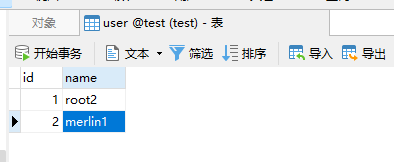

自定义IoC容器

[toc]


# 一、环境准备

- IDEA：编辑器
- JDK 17：Java环境
- Maven 3.8.1：项目依赖管理&项目构建
- MySQL：数据库
- Druid：数据库连接池
- Dom4j：xml文件解析


# 二、项目搭建

## 2.1 创建一个项目

不多赘述，打开idea创建一个空maven项目，pom如下：

```xml
<?xml version="1.0" encoding="UTF-8"?>
<project xmlns="http://maven.apache.org/POM/4.0.0"
         xmlns:xsi="http://www.w3.org/2001/XMLSchema-instance"
         xsi:schemaLocation="http://maven.apache.org/POM/4.0.0 http://maven.apache.org/xsd/maven-4.0.0.xsd">
    <modelVersion>4.0.0</modelVersion>

    <groupId>cc.ilooli</groupId>
    <artifactId>Demo_Custom-IoC</artifactId>
    <version>1.0-SNAPSHOT</version>

    <properties>
        <maven.compiler.source>17</maven.compiler.source>
        <maven.compiler.target>17</maven.compiler.target>
    </properties>

    <dependencies>
        <!--druid连接池-->
        <dependency>
            <groupId>com.alibaba</groupId>
            <artifactId>druid</artifactId>
            <version>1.2.8</version>
        </dependency>
        <!--lombok-->
        <dependency>
            <groupId>org.projectlombok</groupId>
            <artifactId>lombok</artifactId>
            <version>1.18.22</version>
        </dependency>
        <!--MySQL驱动-->
        <dependency>
            <groupId>mysql</groupId>
            <artifactId>mysql-connector-java</artifactId>
            <version>8.0.25</version>
            <scope>compile</scope>
        </dependency>
        <!--xml解析-->
        <dependency>
            <groupId>org.jvnet.hudson.dom4j</groupId>
            <artifactId>dom4j</artifactId>
            <version>1.6.1-hudson-3</version>
        </dependency>
        <!--单元测试-->
        <dependency>
            <groupId>org.junit.jupiter</groupId>
            <artifactId>junit-jupiter</artifactId>
            <version>5.8.2</version>
            <scope>test</scope>
        </dependency>
    </dependencies>

</project>
```

## 2.2 创建项目基础框架

项目已经创建完毕，现在需要向项目中添加一点东西，来搭建一个基础框架并保证我们的项目可以跑通。

### 2.2.1 添加实体类

创建一个User实体类，字段和数据库对应即可：

```java
@Data
public class User {
    private Integer id;
    private String name;
}
```

### 2.2.2 创建一个Druid工具类

基于单例模式创建一个Druid工具类，用于获取数据库连接池并保证全局唯一：

```java
public class DruidUtil {

    private final static DruidDataSource DATA_SOURCE = new DruidDataSource();

    private DruidUtil() {}

    static {
        DATA_SOURCE.setDriverClassName("com.mysql.cj.jdbc.Driver");
        DATA_SOURCE.setUrl("jdbc:mysql://107.172.101.246:3306/test");
        DATA_SOURCE.setUsername("root");
        DATA_SOURCE.setPassword("root");
    }

    public static DruidDataSource getInstance() {
        return DATA_SOURCE;
    }
}
```

### 2.2.3 创建Dao层

创建一个UserDao接口：

```java
public interface UserDao {
    User getUserById(Integer id);
}
```

实现类：

```java
public class UserDaoImpl implements UserDao {

    @SneakyThrows
    @Override
    public User getUserById(Integer id) {
        DruidDataSource dataSource = DruidUtil.getInstance();
        DruidPooledConnection connection = dataSource.getConnection();
        String sql = "select * from user where id = ?";
        PreparedStatement preparedStatement = connection.prepareStatement(sql);
        preparedStatement.setInt(1, id);
        ResultSet resultSet = preparedStatement.executeQuery();

        User user = new User();
        while (resultSet.next()) {
            user.setId(resultSet.getInt("id"));
            user.setName(resultSet.getString("name"));
        }
        resultSet.close();
        preparedStatement.close();
        connection.close();
        return user;
    }
}
```

### 2.2.4 创建UserService层

UserService接口：

```java
public interface UserService {
    User getUserById(Integer id);
}
```

实现类：

```java
public class UserServiceImpl implements UserService {
    @Override
    public User getUserById(Integer id) {
        UserDaoImpl userDao = new UserDaoImpl();
        User user = userDao.getUserById(id);
        System.out.println("user = " + user);
        return user;
    }
}
```

### 2.2.5 测试

现在基础框架已经搭建完毕，我们要来测试一下，确保流程没有问题：

```java
class UserServiceImplTest {

    @Test
    void getUserById() {
        UserServiceImpl userService = new UserServiceImpl();
        userService.getUserById(1);
    }
}
```

测试输出结果如下，可以看到能正确获得数据库中的数据：

```tex
user = User(id=1, name=root)
```

# 三、优化

在上面的基础框架搭建中可以看到，我们的Dao、Service都是直接以new的方式进行实例化的，这种方式会造成类于类之间的强耦合，比如此时要将Dao的实现更换为MyBatis来实现，就需要去更改Service中的对象声明，这样是极不好的，所以我们第一步就是解决这个问题。

## 3.1 使用工厂模式和反射技术消除强耦合

实例化对象的方式除了new之外，我们第一个想到的肯定是==反射==了。将需要进行实例化的类的全限定名配置在xml文件中，通过读取、解析xml文件来获取所需类的全限定名，即可使用反射技术来实例化对象了。

在一个项目中，往往由很多的对象需要实例化，而我们不肯能每个对象都去读取、解析一遍xml文件，所以就要使用工厂模式来配合反射进行解耦。


如上图，创建一个BeanFactory工厂，用户读取和解析xml文件的内容，并将其中的类进行实例化保存到map中，在需要的时候再从map中去出去，这里九体现出了容器的概念。

BeanFactory工厂类：

```java
package cc.ilooli.factory;

import org.dom4j.Element;
import org.dom4j.io.SAXReader;

import java.io.InputStream;
import java.util.HashMap;
import java.util.List;
import java.util.Map;

/**
 * bean工厂
 * 工厂模式应用，生产bean对象，使用反射
 * @author Merlin
 * @date 2022/01/01
 */
public class BeanFactory {
    /** 用于存储实例化后的对象 */
    private final static Map<String, Object> MAP = new HashMap<>();

    static {
        // 使用static关键字声明，当工厂类加载的时候便执行以下步骤
        // 任务一：读取并解析xml通过反射技术实例化对象并存储
        InputStream stream = BeanFactory.class.getClassLoader().getResourceAsStream("beans.xml");
        try {
            // 读取xml文件并获取其根节点（beans标签）
            Element root = new SAXReader().read(stream).getRootElement();
            // 获取beans标签下的所有bean子节点
            List<Element> beans = root.selectNodes("//bean");
            for (Element bean : beans) {
                String id = bean.attributeValue("id");
                String aClass = bean.attributeValue("class");
                // 反射获取类的对象
                Object o = Class.forName(aClass).getConstructor().newInstance();
                // 将id和实例化后的对象放入map存储
                MAP.put(id, o);
            }

        } catch (Exception e) {
            e.printStackTrace();
        }
    }

    /**
     * 任务二：提供外部获取实例对象的接口
     * @param id id
     * @return {@link Object}
     */
    public static Object getBean(String id){
        return MAP.get(id);
    }
}
```

beans.xml文件：

```xml
<?xml version="1.0" encoding="UTF-8" ?>
<!-- 根标签beans，里面配置一个个的bean子标签，每一个bean子标签都代表一个类的配置 -->
<beans>
    <!-- id标识对象，class是类的全限定名 -->
    <bean id="userService" class="cc.ilooli.service.UserServiceImpl"/>
    <bean id="userDao" class="cc.ilooli.dao.UserDaoImpl"/>
</beans>
```

测试：

```java
class BeanFactoryTest {

    @Test
    void getMap() {
        Object userService = BeanFactory.getBean("userService");
        System.out.println("userService = " + userService);
    }
}
```

结果如下，可以看到我们已经成功的通过id获取到了实例化的对象：


接下来就需要将原来Service中的Dao对象的实例化方式改一下了，我们将UserServiceImpl中的`new UserDaoImpl`进行更改，如下：

```java
public class UserServiceImpl implements UserService {
    @Override
    public User getUserById(Integer id) {
        // UserDaoImpl userDao = new UserDaoImpl();
        // 更换为通过id在Bean工厂获取
        UserDao userDao = (UserDao) BeanFactory.getBean("userDao");
        User user = userDao.getUserById(id);
        System.out.println("user = " + user);
        return user;
    }
}
```

同样的，测试类中对Service的声明也可以进行更改：

```java
class UserServiceImplTest {

    @org.junit.jupiter.api.Test
    void getUserById() {
        // UserServiceImpl userService = new UserServiceImpl();
        // 更换为Bean工厂获取
        UserService userService = (UserService) BeanFactory.getBean("userService");
        userService.getUserById(1);
    }
}
```

测试结果如下：


## 3.2 进一步优化，去掉业务代码中的BeanFactory

现在的业务代码中，我们已经可以通过`BeanFactory.getBean("id")`的方式来获取所需的实例化对象了，更换实现类呢也不需要我们再更改业务代码了，直接更改xml配置文件中的class全限定名即可。

但是，还是存在一些问题，每个类中需要所依赖的实例对象都需要使用`BeanFactory.getBean("id")`获取，这算不算代码重复？xml中的id和getBean中的id必须一只，否则获取不到，那万一手抖写错了呢？xml配置文件中的class全限定名写错了呢？针对这些问题，我们一步步来解决。

### 3.2.1 去掉代码中的getBean

现在的代码中获取依赖的实例对象都有这么一句：

```java
UserService userService = (UserService) BeanFactory.getBean("userService");
```

现在不想要这样的方式，更不想用new的方式，我们只想在业务代码中对所需的实例对象进行声明，那还有什么方式来对声明的对象进行赋值呢？

构造方法和set，或者反射。

#### set方法注入

我们先来看set方法，将UserServiceImpl的代码进行如下改造：

```java
public class UserServiceImpl implements UserService {

    private UserDao userDao;
    
    // set方法对userDao进行赋值
    public void setUserDao(UserDao userDao) {
        this.userDao = userDao;
    }
    
    @Override
    public User getUserById(Integer id) {
        User user = userDao.getUserById(id);
        System.out.println("user = " + user);
        return user;
    }
}
```

beans.xml修改如下：

```java
<?xml version="1.0" encoding="UTF-8" ?>
<!-- 根标签beans，里面配置一个个的bean子标签，每一个bean子标签都代表一个类的配置 -->
<beans>
    <!-- id标识对象，class是类的全限定名 -->
    <bean id="userService" class="cc.ilooli.service.UserServiceImpl">
        <!--name是当前对象中需要赋值的对象，将会经过构造后得到“setUserDao”的方法名进行反射注入，ref即需要注入的实例化对象-->
        <property name="userDao" ref="userDao"/>
    </bean>
    <bean id="userDao" class="cc.ilooli.dao.UserDaoImpl"/>
</beans>
```

接下来再来改造BeanFactory来实现我们需要的功能：

```java
package cc.ilooli.factory;

import org.dom4j.Element;
import org.dom4j.io.SAXReader;

import java.io.InputStream;
import java.lang.reflect.Field;
import java.lang.reflect.InvocationTargetException;
import java.lang.reflect.Method;
import java.util.HashMap;
import java.util.List;
import java.util.Map;

/**
 * bean工厂
 * 工厂模式应用，生产bean对象，使用反射
 * @author Merlin
 * @date 2022/01/01
 */
public class BeanFactory {
    /** 用于存储实例化后的对象 */
    private final static Map<String, Object> MAP = new HashMap<>();

    static {
        // 使用static关键字声明，当工厂类加载的时候便执行以下步骤
        // 任务一：读取并解析xml通过反射技术实例化对象并存储
        InputStream stream = BeanFactory.class.getClassLoader().getResourceAsStream("beans.xml");
        try {
            // 读取xml文件并获取其根节点（beans标签）
            Element root = new SAXReader().read(stream).getRootElement();
            // 获取beans标签下的所有bean子节点
            List<Element> beans = root.selectNodes("//bean");
            for (Element bean : beans) {
                String id = bean.attributeValue("id");
                String aClass = bean.attributeValue("class");

                // 反射获取类的对象
                Object o = Class.forName(aClass).getConstructor().newInstance();
                // 将id和实例化后的对象放入map存储
                MAP.put(id, o);
            }

            // 实例化完成之后维护对象的依赖关系，检查哪些对象需要传值，有property节点的bean就有传值需求
            // bean中的property节点
            List<?> propertys = root.selectNodes("//property");
            for (Object o : propertys) {
                Element property = (Element) o;
                // 需要注入的属性名
                String name = property.attributeValue("name");
                String ref = property.attributeValue("ref");
                // 找到需要处理依赖关系的bean，获取父元素
                Element parent = property.getParent();
                // 从MAP中获取当前property的父元素指定的实例化对象
                Object parentObject = MAP.get(parent.attributeValue("id"));
                // 通过属性名称注入
                // inectWhitField(parentObject, name, ref);
                // 通过set方法注入
                injectWithMethod(parentObject, name, ref);
            }

        } catch (Exception e) {
            e.printStackTrace();
        }
    }

    /**
     * 直接声明的属性反射注入
     * @param parentObject 父对象
     * @param name         需要被注入的属性名
     * @param ref          需要注入的对象实例id
     * @throws NoSuchFieldException   没有所需的属性
     * @throws IllegalAccessException 非法访问异常
     */
    private static void inectWhitField(Object parentObject, String name, String ref) throws NoSuchFieldException, IllegalAccessException {
        // 获取该对象的属性
        Field field = parentObject.getClass().getDeclaredField(name);
        // 设置暴力访问
        field.setAccessible(true);
        // 赋值
        field.set(parentObject, MAP.get(ref));
    }

    /**
     * 注入方法
     * 通过set方法注入
     * @param parentObject 父对象
     * @param name         需要被注入的属性名
     * @param ref          需要注入的对象实例id
     * @throws IllegalAccessException    非法访问异常
     * @throws InvocationTargetException 调用目标异常
     */
    private static void injectWithMethod(Object parentObject, String name, String ref) throws IllegalAccessException, InvocationTargetException {
        // 构造set方法名
        String methodName = "set" + name.substring(0, 1).toUpperCase() + name.substring(1);
        // 获取对象的所有方法并遍历
        for (Method declaredMethod : parentObject.getClass().getDeclaredMethods()) {
            // 如果存在某个方法和set方法名一样，就反射执行该方法
            if (methodName.equals(declaredMethod.getName())) {
                declaredMethod.invoke(parentObject, MAP.get(ref));
            }
        }
    }

    /**
     * 任务二：提供外部获取实例对象的接口
     * @param id id
     * @return {@link Object}
     */
    public static Object getBean(String id) {
        return MAP.get(id);
    }
}
```

代码如上所示，测试结果也和之前一样，代码中完成了通过set方法对属性进行注入和直接反射属性进行注入两种方法，而直接反射属性进行注入的方式连set方法都不需要，是不是和我们常见的`@Autowired`差不多呢？

至于构造方法注入，就由各位思考了，此处就不进行实现演示了，原理都是一样的。


## 3.3 事务管理

在前面我们已经解决了对象管理的问题，现在项目中我们可以优雅的编写我们的业务代码，代码中的对象依赖由我们自定义的Ioc容器去进行管理和注入（虽然很简陋，但又不是不能用`手动滑稽`）。

扭头一看，Spring这么优秀的框架，可不止IoC容器这么个东西，还有者事务管理呢。我们现在的项目中没有事务控制，没有那就加上，手动控制JDBC的Connection事务，但是要注意将Connection和当前线程绑定（即保证一个线程只有一个Connection，这样操作才针对的是同一个Connection，进而控制的是同一个事务）。

### 3.3.1 准备事务场景

向Dao和Service中添加一部分代码，来完成事务演示的场景。

UserDao：

```java
public interface UserDao {
    /**
     * 获取用户通过id
     * @param id id
     * @return {@link User}
     */
    User getUserById(Integer id);

    /**
     * 更新用户
     * @param user 用户
     */
    void updateUser(User user);
}
```

UserDaoImpl:

```java
public class UserDaoImpl implements UserDao {

    @SneakyThrows
    @Override
    public User getUserById(Integer id) {
        DruidDataSource dataSource = DruidUtil.getInstance();
        DruidPooledConnection connection = dataSource.getConnection();
        String sql = "select * from user where id = ?";
        PreparedStatement preparedStatement = connection.prepareStatement(sql);
        preparedStatement.setInt(1, id);
        ResultSet resultSet = preparedStatement.executeQuery();

        User user = new User();
        while (resultSet.next()) {
            user.setId(resultSet.getInt("id"));
            user.setName(resultSet.getString("name"));
        }
        resultSet.close();
        preparedStatement.close();
        connection.close();
        return user;
    }

    @SneakyThrows
    @Override
    public void updateUser(User user) {
        DruidDataSource dataSource = DruidUtil.getInstance();
        DruidPooledConnection connection = null;
        PreparedStatement preparedStatement = null;
        try {
            connection = dataSource.getConnection();
            String sql = "update user set name = ? where id = ?";
            preparedStatement = connection.prepareStatement(sql);
            preparedStatement.setString(1, user.getName());
            preparedStatement.setInt(2, user.getId());
            preparedStatement.executeUpdate();
        } finally {
            if (preparedStatement != null) {
                preparedStatement.close();
            }
            if (connection != null) {
                connection.close();
            }
        }
    }
}
```

Uservice:

```java
public interface UserService {
    /**
     * 获取用户通过id
     * @param id id
     * @return {@link User}
     */
    User getUserById(Integer id);

    /**
     * 更新用户
     * @param user 用户
     */
    void updateUser(User user);
}
```

UserServiceImpl:

```java
public class UserServiceImpl implements UserService {

    private UserDao userDao;

    // set方法对userDao进行赋值
    public void setUserDao(UserDao userDao) {
        this.userDao = userDao;
    }

    @Override
    public User getUserById(Integer id) {
        User user = userDao.getUserById(id);
        System.out.println("user = " + user);
        return user;
    }

    @Override
    public void updateUser(User user) {
        userDao.updateUser(user);
    }
}
```

 测试类中添加更新用户的测试方法：

```java
@Test
void updateUser() {
  User user1 = new User(1, "root1");
  User user2 = new User(2, "merlin1");

  UserService userService = (UserService) BeanFactory.getBean("userService");
  userService.updateUser(user1);
  userService.updateUser(user2);
}
```

接下来进行测试，先看一下数据库中的原始数据：


执行测试方法之后：


加下来我们人为制造一个错误来模拟实际业务中的错误，在测试中更新的中间加一个错误：

```java
@Test
void updateUser() {
  User user1 = new User(1, "root2");
  User user2 = new User(2, "merlin2");

  UserService userService = (UserService) BeanFactory.getBean("userService");
  userService.updateUser(user1);
  int i = 1 / 0;
  userService.updateUser(user2);
}
```

来看看测试结果：


测试失败，出现了除零错误，那我们来看看数据库：



数据库中1号用户的名字变了，但是2号的却还是原来的，这不合我们的要求，我们要的是一起变。这就是没有事务控制的原因。接下来将会为项目加上事务控制。

 数据库事务归根结底还是Connection的事务，`connection.commit()`提交事务，`connection.rollback()`回滚事务。

演示中的两次`update()`方法使用了两个数据链接connection，这样当然不是同一个connection来控制事务。即现在的事务控制在dao层，没有在service层进行控制。（从代码可知，dao通过DruidUtil获取一个数据库链接connection，执行sql语句之后进行了`close()`操作，即每次执行`update()`方法都会从新获取一个数据库连接，并且在执行完成之后执行`close()`来关闭当前连接）。

### 3.3.2 解决思路

把事务控制添加到service层。

既然我们的业务都是在service层，并且要保证service执行的数据一致性，那么就把事务控制放到service层来。怎么才能让两次`update()`方法都是用同一个connection呢？

两次的`update()`方法都是在同一个线程内执行的，那我们就可以给当前线程绑定一个connection，和当前线程有关系的数据库操作都是用这个connection（从当前线程去获取）。

### 3.3.3 创建ConnectionUtil来管理线程与连接

在utils包下创建一个ConnectionUtil工具类，代码如下：

```java
public class ConnectionUtil {

    private ConnectionUtil(){}

    private static final ConnectionUtil UTIL = new ConnectionUtil();

    /**
     * 获取实例，使用单例模式确保在当前线程内此对象唯一、数据库连接才能是同一个
     * @return {@link ConnectionUtil}
     */
    public static ConnectionUtil getInstance() { return UTIL; }

    /** 存储当前线程的连接 */
    private final ThreadLocal<Connection> threadLocal = new ThreadLocal<>();

    public Connection getConnection() throws SQLException {
        // 从线程中获取连接
        Connection connection = threadLocal.get();
        // 判断获取到的连接是否为空，若为空，则从连接池获取一个连接并绑定到当前线程
        if (connection == null) {
            connection = DruidUtil.getInstance().getConnection();
            threadLocal.set(connection);
        }
        return connection;
    }

    public void close(){
        // 回收自定义ThreadLocal变量，避免内存泄漏
        threadLocal.remove();
    }
}
```

修改Dao实现，更换数据库连接的获取方式：

```java
public class UserDaoImpl implements UserDao {

    @SneakyThrows
    @Override
    public User getUserById(Integer id) {
        Connection connection = ConnectionUtil.getInstance().getConnection();
        String sql = "select * from user where id = ?";
        PreparedStatement preparedStatement = connection.prepareStatement(sql);
        preparedStatement.setInt(1, id);
        ResultSet resultSet = preparedStatement.executeQuery();

        User user = new User();
        while (resultSet.next()) {
            user.setId(resultSet.getInt("id"));
            user.setName(resultSet.getString("name"));
        }
        resultSet.close();
        preparedStatement.close();
        // 数据库连接需要多次使用，不可关闭
        // connection.close();
        return user;
    }

    @SneakyThrows
    @Override
    public void updateUser(User user) {
        Connection connection = null;
        PreparedStatement preparedStatement = null;
        try {
            // 通过ConnectionUtil获取当前线程绑定的数据库连接
            connection = ConnectionUtil.getInstance().getConnection();
            String sql = "update user set name = ? where id = ?";
            preparedStatement = connection.prepareStatement(sql);
            preparedStatement.setString(1, user.getName());
            preparedStatement.setInt(2, user.getId());
            preparedStatement.executeUpdate();
        } finally {
            if (preparedStatement != null) {
                preparedStatement.close();
            }
            // 数据库连接需要多次使用，不可关闭
//            if (connection != null) {
//                connection.close();
//            }
        }
    }
}
```

### 3.3.4 把事务控制添加到service层的方法上

演示中将单测当成业务service层或者controller层即可。我们在单测中来测试一下事务控制。

```java
 @SneakyThrows
    @Test
    void updateUser() {
        User user1 = new User(1, "root3");
        User user2 = new User(2, "merlin3");

        UserService userService = (UserService) BeanFactory.getBean("userService");
        Connection connection = ConnectionUtil.getInstance().getConnection();

        try {
            // 开启事务，关闭自动提交
            connection.setAutoCommit(false);

            userService.updateUser(user1);
            int i = 1 / 0;
            userService.updateUser(user2);

            // 提交事务
            connection.commit();
        } catch (Exception e) {
            e.printStackTrace();
            // 回滚事务
            connection.rollback();
            // 抛出异常，便于上层捕获处理
            throw e;
        } finally {
            ConnectionUtil.getInstance().close();
        }
    }
}
```

来跑一下测试，可以看到测试失败，也打印了错误信息：


再来看看数据库，也都没有变，说明我们的事务控制成功了：


### 3.3.5 添加一个事务管理器

兄啊，这每个事务都需要在业务代码中获取当前线程内绑定的数据库连接，还要关闭自动提交，然后手动提交事务、捕获异常回滚，太多与业务无关的代码了，一点都不够优雅。

不用着急，这就解决这个问题。

我们向项目中添加一个事务管理器，将业务中的事务交由事务管理器来管理，而我们，只要专注业务即可。

```java
public class TransactionManager {
    
    private TransactionManager() {}
    
    private static final ConnectionUtil connectionUtil = ConnectionUtil.getInstance();

    /**
     * 开始事务
     * @throws SQLException sqlexception异常
     */
    public static void beginTransaction() throws SQLException {
        connectionUtil.getConnection().setAutoCommit(false);
    }

    /**
     * 提交
     * @throws SQLException sqlexception异常
     */
    public static void commit() throws SQLException {
        connectionUtil.getConnection().commit();
    }

    /**
     * 回滚
     * @throws SQLException sqlexception异常
     */
    public static void rollback() throws SQLException {
        connectionUtil.getConnection().rollback();
    }
}
```

修改单测代码：

```java
class UserServiceImplTest {

    @org.junit.jupiter.api.Test
    void getUserById() {
        // UserServiceImpl userService = new UserServiceImpl();
        // 更换为Bean工厂获取
        UserService userService = (UserService) BeanFactory.getBean("userService");
        userService.getUserById(1);
    }

    @SneakyThrows
    @Test
    void updateUser() {
        User user1 = new User(1, "root3");
        User user2 = new User(2, "merlin3");

        UserService userService = (UserService) BeanFactory.getBean("userService");

        try {
            // 开启事务，关闭自动提交
            TransactionManager.beginTransaction();

            userService.updateUser(user1);
            int i = 1 / 0;
            userService.updateUser(user2);

            // 提交事务
            TransactionManager.commit();
        } catch (Exception e) {
            e.printStackTrace();
            // 回滚事务
            TransactionManager.rollback();
            // 抛出异常，便于上层捕获处理
            throw e;
        } finally {
            ConnectionUtil.getInstance().close();
        }
    }
}
```

测试结果和之前一样，符合预期。

## 3.4 优化事务管理

上面的修改还是不够优雅，我们还是需要在业务代码中使用事务管理器来手动的控制提交和回滚，远远达不到我们的期望，所以还要继续优化，我们的目标是业务里面就写业务的代码，事务管理不在业务代码中体现。

那怎么才能实现呢？AOP + 动态代理！（动态代理不在此赘述，有需要的可自行了解）

先来进行一下代码改造，把业务逻辑放回Service而不是放在测试里…而把测试当作controller层来调用service的代码。如下：

userService:

```java
public class UserServiceImpl implements UserService {

    private UserDao userDao;

    // set方法对userDao进行赋值
    public void setUserDao(UserDao userDao) {
        this.userDao = userDao;
    }

    @Override
    public User getUserById(Integer id) {
        User user = userDao.getUserById(id);
        System.out.println("user = " + user);
        return user;
    }

    @Override
    public void updateUser() throws SQLException {
        User user1 = new User(1, "root3");
        User user2 = new User(2, "merlin3");
        
        try {
            // 开启事务，关闭自动提交
            TransactionManager.beginTransaction();

            userDao.updateUser(user1);
            int i = 1 / 0;
            userDao.updateUser(user2);

            // 提交事务
            TransactionManager.commit();
        } catch (Exception e) {
            e.printStackTrace();
            // 回滚事务
            TransactionManager.rollback();
            // 抛出异常，便于上层捕获处理
            throw e;
        } finally {
            ConnectionUtil.getInstance().close();
        }
    }
}
```

测试方法：

```java
@SneakyThrows
@Test
void updateUser(){
  UserService userService = (UserService) BeanFactory.getBean("userService");
  userService.updateUser();
}
```

写下来就是进行优化了，思路是这样的：通过动态代理获取service的代理对象，然后通过AOP对代理对象进行功能增强，增加事务控制，测试方法（controller）再调用代理对象执行方法。


### 3.4.1 创建代理工厂

由于该工厂只需要一个即可，故采用单例模式实现：

```java
public class ProxyFactory {

    private ProxyFactory(){}

    private static final ProxyFactory INSTANCE = new ProxyFactory();

    pu static ProxyFactory getInstance() {return INSTANCE;}

    public Object getJdkProxy(Object target){
        return  Proxy.newProxyInstance(target.getClass().getClassLoader(), target.getClass().getInterfaces(), new InvocationHandler() {
            @Override
            public Object invoke(Object proxy, Method method, Object[] args) throws Throwable {
                Object result = null;
                try{
                    // 开启事务控制
                    TransactionManager.beginTransaction();
                    // 执行原有逻辑
                    result = method.invoke(target, args);
                    // 提交事务
                    TransactionManager.commit();
                }catch (Exception e){
                    e.printStackTrace();
                    // 事务回滚
                    TransactionManager.rollback();
                    // 抛出异常
                    throw e;
                }
                return result;
            }
        });
    }
}
```

### 3.4.2 修改service业务代码

在使用了代理对象来实现事务控制了之后，那我们的业务代码就可以回归业务了：

```java
public class UserServiceImpl implements UserService {

    private UserDao userDao;

    // set方法对userDao进行赋值
    public void setUserDao(UserDao userDao) {
        this.userDao = userDao;
    }

    @Override
    public User getUserById(Integer id) {
        User user = userDao.getUserById(id);
        System.out.println("user = " + user);
        return user;
    }

    @Override
    public void updateUser() throws SQLException {
        User user1 = new User(1, "root3");
        User user2 = new User(2, "merlin3");

        userDao.updateUser(user1);
        int i = 1 / 0;
        userDao.updateUser(user2);
    }
}
```

### 3.4.3 从代理工厂获取代理对象

因为我们是在代理对象实现的事务控制，原来的service是已经没有事务了，所以我们需要将测试方法（controller）中的依赖对象换成从代理工厂获取的：

```java
@SneakyThrows
@Test
void updateUser(){
  UserService userService = (UserService) ProxyFactory.getInstance().getJdkProxy(BeanFactory.getBean("userService"));
  userService.updateUser();
}
```

此时再进行测试，测试结果和之前一样，但是我们的代码却更加优雅了。


更进一步的，我们也可以将框架中的各个类都交由BeanFactory来进行管理，让它来为我们的项目中自动注入所需的依赖对象。
