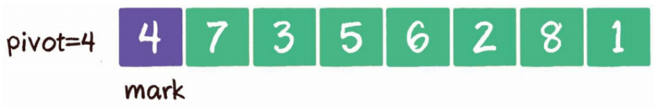

# 1、树

## 1.1 概念

有很多数据的逻辑关系并不是线性关系，在实际场景中，常常存在着一对多，甚至是多对多的情况。

组织结构：


书的目录：


以上的数据结构，我们称为树。在数据结构中，树的定义如下：

树（tree）是n（n≥0）个节点的有限集。

当n=0时，称为空树。在任意一个非空树中，有如下特点：

- 有且仅有一个特定的称为根的节点。
- 当n>1时，其余节点可分为m（m>0）个互不相交的有限集
- 每一个集合本身又是一个树，并称为根的子树。

一个标准的树结构：


节点1是根节点（root），没有父节点；节点5、6、7、8是树的末端，没有“孩子”，被称为叶子节点（leaf）；节点2、3、4、是树的中端，有父节点，有孩子，被称为中间节点或枝节点。

图中的虚线部分，是根节点1的其中一个子树。

树的最大层级数，被称为树的高度或深度，上图这个树的高度是4。


树的分类：


## 1.2 二叉树

二叉树（binary tree）是树的一种特殊形式。二叉，顾名思义，这种树的每个节点最多有2个孩子节点。注意，这里是最多有2个，也可能只有1个，或者没有孩子节点。


二叉树节点的两个孩子节点，一个被称为左孩子（left child），一个被称为右孩子（right child）。这两个孩子节点的顺序是固定的，左孩子小于右孩子。

- 满二叉树

  一个二叉树的所有非叶子节点都存在左右孩子，并且所有叶子节点都在同一层级上，那么这个树就是满二叉树。
  

- 完全二叉树

  对一个有n个节点的二叉树，按层级顺序编号，则所有节点的编号为从1到n。如果这个树所有节点和同样深度的满二叉树的编号为从1到n的节点位置相同，则这个二叉树为完全二叉树。
  

满二叉树要求所有分支都是满的；而完全二叉树只需保证最后一个节点之前的节点都齐全即可。

### 二叉树的存储

二叉树属于逻辑结构，可以使用链表和数组进行存储。

- **链式存储**
  
  
  二叉树的每一个节点包含3部分：存储数据的data变量、指向左孩子的left指针、指向右孩子的right指针。

- 数组存储

使用数组存储时，会按照层级顺序把二叉树的节点放到数组中对应的位置上。如果某一个节点的左孩子或右孩子空缺，则数组的相应位置也空出来。

寻址方式：

一个父节点的下标是n，那么它的左孩子节点下标就是2×n+1、右孩子节点下标就是2\*(n+1)，对于一个稀疏的二叉树（孩子不满）来说，用数组表示法是非常浪费空间的，所以二叉树一般用链表存储实现（二叉堆除外）。

### 二叉查找树

二叉查找树(binary search tree)，二叉查找树在二叉树的基础上增加了以下几个条件：

1. 如果左子树不为空，则左子树上所有节点的值均小于根节点的值
2. 如果右子树不为空，则右子树上所有节点的值均大于根节点的值
3. 左、右子树也都是二叉查找树

如下图：


二叉查找树要求左子树小于父节点，右子树大于父节点，正是这样保证了二叉树的有序性。因此二叉查找树还有另一个名字——**二叉排序树（binary sort tree）**。

- 查找
  例如查找值为4的节点，步骤如下：
  1. 访问根节点6，发现4<6。
  2. 访问节点6的左孩子节点3，发现4>3
  3. 访问节点3的右孩子节点4，发现4=4，这正是要查找的节点
  
  对于一个节点分布相对均衡的二叉查找树来说，如果节点总数是n，那么搜索节点的时间复杂度就是O(logn)，和树的深度是一样的。这种方式正是二分查找思想。
  


- 插入

  例如插入新元素5，步骤如下：
  1. 访问根节点6，发现 5<6
  2. 访问节点6的左孩子节点3，发现 5>3
  3. 访问节点3的右孩子节点4，发现 5>4
  4. 5 最终会插入到节点4的右孩子位置
  
  . 
  


### 二叉树的遍历

二叉树，是典型的非线性数据结构，遍历时需要把非线性关联的节点转化成一个线性的序列，以不同的方式来遍历，遍历出的序列顺序也不同。

二叉树的遍历包括：

#### 1、深度优先遍历

所谓深度优先，顾名思义，就是偏向于纵深，“一头扎到底”的访问方式。它包括：

- 前序遍历

  二叉树的前序遍历，输出顺序是根节点、左子树、右子树。
  

  步骤如下：
  1、首先输出的是根节点1
  2、由于根节点1存在左孩子，输出左孩子节点2
  3、由于节点2也存在左孩子，输出左孩子节点4
  4、节点4既没有左孩子，也没有右孩子，那么回到节点2，输出节点2的右孩子节点5
  5、节点5既没有左孩子，也没有右孩子，那么回到节点1，输出节点1的右孩子节点3
  6、节点3没有左孩子，但是有右孩子，因此输出节点3的右孩子节点6
  到此为止，所有的节点都遍历输出完毕。
  
  
  
- 中序遍历 

  二叉树的中序遍历，输出顺序是左子树、根节点、右子树。
  
  
  步骤如下：
  1、首先访问根节点的左孩子，如果这个左孩子还拥有左孩子，则继续深入访问下去，一直找到不再有左孩子 的节点，并输出该节点。显然，第一个没有左孩子的节点是节点4
  2、依照中序遍历的次序，接下来输出节点4的父节点2
  3、再输出节点2的右孩子节点5
  4、以节点2为根的左子树已经输出完毕，这时再输出整个二叉树的根节点1
  5、由于节点3没有左孩子，所以直接输出根节点1的右孩子节点3
  6、最后输出节点3的右孩子节点6
  到此为止，所有的节点都遍历输出完毕。
  
  


- 后序遍历

  二叉树的后序遍历，输出顺序是左子树、右子树、根节点。
  
  
  步骤如下：
  1、首先访问根节点的左孩子，如果这个左孩子还拥有左孩子，则继续深入访问下去，一直找到不再有左孩子 的节点，并输出该节点。显然，第一个没有左孩子的节点是节点4
  2、输出右节点5
  3、输出节点4的父节点2
  4、以节点2为根的左子树已经输出完毕，这时再输出整个二叉树的右子树
  5、访问根节点的右孩子，如果这个右孩子拥有左孩子，则继续深入访问下去，一直找到不再有左孩子 的节点，如果没有左孩子则找右孩子，并输出该节点6
  6、输出节点6的父节点3
  到此为止，所有的节点都遍历输出完毕。

```java
/**
 * 树节点
 */
class TreeNode {
    int data; //数据
    TreeNode leftChild; //左孩子
    TreeNode rightChild; //右孩子

    TreeNode(int data) {
        this.data = data;
    }
}

/**
 * 二叉树遍历
 */
class BinaryTree {
    TreeNode root;

    public void insertNode(int data) {
        root = insert(root, data);
    }

    private TreeNode insert(TreeNode node, int data) {
        //如果是空则插入第一个节点
        if (node == null) return new TreeNode(data);
        //插左边
        if (data < node.data) {
            node.leftChild = insert(node.leftChild, data);
        }
        //插右边
        else if (data > node.data) {
            node.rightChild = insert(node.rightChild, data);
        } else {
            node.data = data;
        }
        return node;
    }

    /*
     * 前序遍历
     */
    public void preOrderTraveral(TreeNode node) {
        if (node == null) {
            return;
        }
        System.out.println(node.data);
        preOrderTraveral(node.leftChild);
        preOrderTraveral(node.rightChild);
    }

    /*
     * 中序遍历
     */
    public void inOrderTraveral(TreeNode node) {
        if (node == null) {
            return;
        }
        inOrderTraveral(node.leftChild);
        System.out.println(node.data);
        inOrderTraveral(node.rightChild);
    }

    /*
     * 后序遍历
     */
    public void postOrderTraveral(TreeNode node) {
        if (node == null) {
            return;
        }
        postOrderTraveral(node.leftChild);
        postOrderTraveral(node.rightChild);
        System.out.println(node.data);
    }

    public static void main(String[] args) {
        BinaryTree btt = new BinaryTree();
        btt.insertNode(10);
        btt.insertNode(8);
        btt.insertNode(11);
        btt.insertNode(7);
        btt.insertNode(9);
        btt.insertNode(12);
        btt.preOrderTraveral(btt.root);
        System.out.println("========================");
        btt.inOrderTraveral(btt.root);
        System.out.println("========================");
        btt.postOrderTraveral(btt.root);
    }
}
```

#### 2、广度优先遍历

广度优先遍历，也叫层序遍历，顾名思义，就是二叉树按照从根节点到叶子节点的层次关系，一层一层横向遍历各个节点。


二叉树同一层次的节点之间是没有直接关联的，利用队列可以实现。

1. 根节点1进入队列。
 


2. 节点1出队，输出节点1，并得到节点1的左孩子节点2、右孩子节点3。让节点2和节点3入队。
 


3. 节点2出队，输出节点2，并得到节点2的左孩子节点4、右孩子节点5。让节点4和节点5入队。
 


4. 节点3出队，输出节点3，并得到节点3的右孩子节点6。让节点6入队。


5. 节点4出队，输出节点4，由于节点4没有孩子节点，所以没有新节点入队。
 


6. 节点5出队，输出节点5，由于节点5同样没有孩子节点，所以没有新节点入队。


7. 节点6出队，输出节点6，节点6没有孩子节点，没有新节点入队。


代码：

```java
/*
 * 层序遍历
 */
public void levelOrderTraversal(TreeNode root) {
    Queue<TreeNode> queue = new LinkedList<TreeNode>();
    queue.offer(root);
    while (!queue.isEmpty()) {
        TreeNode node = queue.poll();
        System.out.println(node.data);
        if (node.leftChild != null) {
            queue.offer(node.leftChild);
        }
        if (node.rightChild != null) {
            queue.offer(node.rightChild);
        }
    }
}
```

### 时间复杂度

二叉查找树的插入和查找时间复杂度为:O(log n) 。

极端情况下二叉查找树退化成链表，时间复杂度为O(n)，所以需要平衡二叉查找树。

### 应用

- 非线性数据：菜单，组织结构、家谱等等

- 线性数据：二叉查找树

二叉查找树是有序的，我们只需要中序遍历，就可以在 O(n) 的时间复杂度内，输出有序的数据序列。二叉查找树的性能非常稳定，扩容很方便(链表实现)。

## 1.3 红黑树

### 平衡二叉查找树


这种二叉查找树就退化成了链表，由于树的深度变得多了，查找的效率也会大幅下降，所以需要对这种二叉树进行自平衡，红黑树就是一种自平衡的二叉查找树。

### 红黑树（Red Black Tree）

除了二叉查找树(BST)的特征外，还有以下特征：

- 每个节点要么是黑色，要么是红色
- 根节点是黑色
- 每个叶子节点都是黑色的空结点（NIL结点）（为了简单期间，一般会省略该节点）
- 如果一个节点是红色的，则它的子节点必须是黑色的（父子不能同为红）
- 从任一结点到其每个叶子的所有路径都包含相同数目的黑色结点（平衡的关键）
- 新插入节点默认为红色，插入后需要校验红黑树是否符合规则，不符合则需要进行平衡

一颗典型的红黑树：


在对红黑树进行添加或者删除操作时可能会破坏这些特点，所以红黑树采取了很多方式来维护这些特点，从而维持平衡。主要包括：左旋转、右旋转和颜色反转。

### 左旋（RotateLeft）

逆时针旋转红黑树的两个结点，使得父结点被自己的右孩子取代，而自己成为右子节点的左孩子。


### 右旋（RotateRight） 

顺时针旋转红黑树的两个结点，使得父结点被自己的左孩子取代，而自己成为左子节点的右孩子


### 颜色反转

就是当前节点与父节点、叔叔节点同为红色，这种情况违反了红黑树的规则，需要将红色向祖辈上传， 父节点和叔叔节点红色变为黑色，爷爷节点从黑色变为红色（爷爷节点必为黑色，因为此前是符合红黑树规则的）。这样每条叶子结点到根节点的黑色节点数量并未发生变化，因此都其他树结构不产生影响。


红黑树插入有五种情况，每种情况对应着不同的调整方法：

1. 新结点（A）位于树根，没有父结点

   直接让新结点变色为黑色，规则2得到满足。同时，黑色的根结点使得每条路径上的黑色结点数目都增加了1，所以并没有打破规则5。
   


2. 新结点（B）的父结点是黑色

   新插入的红色结点B并没有打破红黑树的规则，所以不需要做任何调整。
   


3. 新结点（D）的父结点和叔叔结点都是红色

   两个红色结点B和D连续，违反了规则4。因此我们先让结点B变为黑色。
   

   这样一来，结点B所在路径凭空多了一个黑色结点，打破了规则5。因此我们让结点A变为红色。
   

   结点A和C又成为了连续的红色结点，我们再让结点C变为黑色。  
   

   经过上面的调整，这一局部重新符合了红黑树的规则。 
   


4. 新结点（D）的父结点是红色，叔叔结点是黑色或者没有叔叔，且新结点是父结点的右孩子，父结点（B）是祖父结点的左孩子。
   
    我们以结点B为轴，做一次左旋转，使得新结点D成为父结点，原来的父结点B成为D的左孩子。这样进入了情况5。
    


5. 新结点（D）的父结点是红色，叔叔结点是黑色或者没有叔叔，且新结点是父结点的左孩子，父结点（B）是祖父结点的左孩子。

   我们以结点A为轴，做一次右旋转，使得结点B成为祖父结点，结点A成为结点B的右孩子。
   

   接下来，我们让结点B变为黑色，结点A变为红色。
   

   经过上面的调整，这一局部重新符合了红黑树的规则。


### 红黑树构建过程


上图所示过程如下：

1. 新插入节点默认为红色，5<10，插入到左子节点，插入后左子树深度为2（叶子节点黑色+根节点黑色），右子树深度为也是2（叶子节点黑色+根节点黑色），满足红黑树规则。

2. 新插入节点为红色，9<10，需要在左子树进行插入，再和5比较，大于5，放到5的右子树中，此时各个叶子节点到根节点的深度依然是2，但5和9两个节点都是红色，不满足规则第4条，需要进行左旋、右旋操作，使其符合规则。可以看出经过操作后，左右子树又维持了平衡。


上图所示过程如下：

1. 插入节点3后，可以看到又不符合红黑树的规则了，而此时的情况，需要采用颜色反转的操作，就是把5、10两个节点变为黑色，5、10的父节点变为红色，但父节点9是根节点，不能为红色，于是再将9变为黑色，这样整个树的深度其实增加了1层。
2. 继续插入6节点，对树深度没有影响。
3. 插入7节点后，6、7节点都为红节点，不满足规则4，需要进行颜色反转调整，也就是7的父节点和叔叔节点变为黑色，爷爷节点5变为红色。


上图所示过程如下：
1. 继续插入节点19，对树深度没有影响，红黑树的规则都满足，无需调整。
2. 插入节点32后，又出现了不满足规则4的情况，此时节点32没有叔叔节点，如果颜色反转的话，左右子树的深度就出现不一致的情况，所以需要对爷爷节点进行左旋操作。
3. 父节点取代爷爷节点的位置，父节点变为黑色，爷爷节点变为父节点的左子树变为红色。


上图所示过程如下：
1. 插入节点24后，红黑树不满足规则4，需要调整。
2. 此时父节点32和叔叔节点10都为红色，需要进行颜色反转，爷爷节点19变为红色，父节点、叔叔节点变为黑色，颜色反转树的深度不发生变化。


上图所示过程如下： 插入节点17后，未破坏红黑树规则，不需要调整。

### 完整代码

```java
import lombok.Data;

/**
 * 红黑树节点
 */
@Data
public class RBTreeNode {
    private int key;
    private boolean isBlack;
    private RBTreeNode left;
    private RBTreeNode right;
    private RBTreeNode parent;

    public RBTreeNode(int key) {
        this.key = key;
        this.isBlack = false;   // 新节点默认红色
    }

    @Override
    public String toString() {
        return "RBTreeNode{" +
                "key=" + key +
                ", color=" + (isBlack ? "BLACK" : "RED") +
                '}';

    }
}
```

```java
/**
 * 红黑树
 */
class RBTree {
    RBTreeNode root;    // 根节点

    /**
     * 遍历节点
     *
     * @param node 节点
     */
    public void list(RBTreeNode node) {
        if (node == null) return;
        // 叶子
        if (node.getLeft() == null && node.getRight() == null) {
            System.out.println(node);
            return;
        }
        // 输出当前节点值
        System.out.println(node);
        // 递归 左孩子
        list(node.getLeft());
        // 递归 右孩子
        list(node.getRight());
    }

    /**
     * 插入
     *
     * @param key 值
     */
    public void insert(int key) {
        RBTreeNode node = new RBTreeNode(key);
        // 根节点为空，则插入值为根节点
        if (root == null) {
            node.setBlack(true);    // 根节点是黑色的
            root = node;
            return;
        }

        RBTreeNode parent = root;
        RBTreeNode son;
        if (key <= parent.getKey()) {
            son = parent.getLeft();
        } else {
            son = parent.getRight();
        }
        // 找位置
        while (son != null) {
            parent = son;
            if (key <= parent.getKey()) {
                son = parent.getLeft();
            } else {
                son = parent.getRight();
            }
        }

        if (key <= parent.getKey()) {
            parent.setLeft(node);
        } else {
            parent.setRight(node);
        }

        node.setParent(parent);
        // 自平衡
        this.banlanceInsert(node);
    }

    /**
     * 自平衡
     *
     * @param node 节点
     */
    private void banlanceInsert(RBTreeNode node) {
        RBTreeNode father, uncle, grandFather;

        while ((father = node.getParent()) != null && !father.isBlack()) {
            grandFather = father.getParent();
            //父为祖左孩子
            if (grandFather.getLeft() == father) {
                if ((uncle = grandFather.getRight()) != null && !uncle.isBlack()) {
                    father.setBlack(true);
                    uncle.setBlack(true);
                    grandFather.setBlack(false);
                    node = grandFather;
                    continue;
                }
                if (node == father.getRight()) {
                    //左旋
                    this.leftRotate(father);
                    RBTreeNode tmp = node;
                    node = father;
                    father = tmp;
                }
                father.setBlack(true);
                grandFather.setBlack(false);
                //右旋
                this.rightRotate(grandFather);
            }
            //父为祖右孩子
            else {
                if ((uncle = grandFather.getLeft()) != null && !uncle.isBlack()) {
                    father.setBlack(true);
                    uncle.setBlack(true);
                    grandFather.setBlack(false);
                    node = grandFather;
                    continue;
                }
                if (node == father.getLeft()) {
                    //右旋
                    this.rightRotate(father);
                    RBTreeNode tmp = node;
                    node = father;
                    father = tmp;
                }
                father.setBlack(true);
                grandFather.setBlack(false);
                //左旋
                this.leftRotate(grandFather);
            }
        }
        root.setBlack(true);
    }

    /**
     * 左旋
     *
     * @param node 节点
     */
    private void leftRotate(RBTreeNode node) {
        RBTreeNode right = node.getRight();
        RBTreeNode parent = node.getParent();
        if (parent == null) {
            root = right;
            right.setParent(null);
        } else {
            if (parent.getLeft() != null && parent.getLeft() == node) {
                parent.setLeft(right);
            } else {
                parent.setRight(right);
            }
            right.setParent(parent);
        }
        node.setParent(right);
        node.setRight(right.getLeft());
        if (right.getLeft() != null) {
            right.getLeft().setParent(node);
        }
        right.setLeft(node);
    }

    /**
     * 右旋
     *
     * @param node 节点
     */
    private void rightRotate(RBTreeNode node) {
        RBTreeNode left = node.getLeft();
        RBTreeNode parent = node.getParent();
        if (parent == null) {
            root = left;
            left.setParent(null);
        } else {
            if (parent.getLeft() != null && parent.getLeft() == node) {
                parent.setLeft(left);
            } else {
                parent.setRight(left);
            }
            left.setParent(parent);
        }
        node.setParent(left);
        node.setLeft(left.getRight());
        if (left.getRight() != null) {
            left.getRight().setParent(node);
        }
        left.setRight(node);
    }

    public static void main(String[] args) {
        RBTree rb = new RBTree();
        rb.insert(10);//根节点
        rb.insert(5);
        rb.insert(9);
        rb.insert(3);
        rb.insert(6);
        rb.insert(7);
        rb.insert(19);
        rb.insert(32);
        rb.insert(24);
        rb.insert(17);
        rb.list(rb.root);
    }

}
```

输出结果：

```
RBTreeNode{key=9, color=BLACK}
RBTreeNode{key=5, color=RED}
RBTreeNode{key=3, color=BLACK}
RBTreeNode{key=6, color=BLACK}
RBTreeNode{key=7, color=RED}
RBTreeNode{key=19, color=RED}
RBTreeNode{key=10, color=BLACK}
RBTreeNode{key=17, color=RED}
RBTreeNode{key=32, color=BLACK}
RBTreeNode{key=24, color=RED}
```

### 时间复杂度

O(log n)

### 应用

在JDK1.8中HashMap使用`数组+链表+红黑树`的数据结构。内部维护着一个数组table，该数组保存着每个链表的表头结点或者树的根节点。HashMap存储数据的数组定义如下，里面存放的是Node<K,V>实体：

```java
transient Node<K, V>[] table;	//序列化时不自动保存

/*** 
* 桶的树化阈值：即 链表转成红黑树的阈值， 
* 在存储数据时，当链表长度 > 该值时，则将链表转换成红黑树 
*/ 
static final int TREEIFY_THRESHOLD = 8;
```


## 1.4 多路查找树

**多路查找树(muitl-way search tree)**，其每一个节点的孩子数可以多于两个，且每一个节点处可以存储多个元素。

### B树

**B树（BalanceTree）**是对二叉查找树的改进。它的设计思想是，将相关数据尽量集中在一起，以便一次读取多个数据，减少硬盘操作次数。

一棵m阶的B 树 (m叉树)的特性如下：

- B树中所有节点的孩子节点数中的最大值称为B树的阶，记为M
- 树中的每个节点至多有M棵子树，即：如果定了M，则这个B树中任何节点的子节点数量都不能超过M
- 若根节点不是终端节点，则至少有两棵子树
- 除根节点和叶节点外，所有点至少有m/2棵子树
- 所有的叶子结点都位于同一层

#### B-Tree


#### B+Tree

B+树是B-树的变体，也是一种多路搜索树，其定义基本与B树相同，它的自身特征是：

- 非叶子结点的子树指针与关键字个数相同
- 非叶子结点的子树指针P[i]，指向关键字值属于[K[i], K[i+1])的子树
- 为所有叶子结点增加一个链指针
- 所有关键字都在叶子结点出现


### 典型应用

**MySQL索引B+Tree**

B树是为了磁盘或其它存储设备而设计的一种多叉（下面你会看到，相对于二叉，B树每个内结点有多个分支，即多叉）平衡查找树。 

- B树的高度一般都是在2-4这个高度，`树的高度直接影响IO读写的次数`。
- 如果是三层树结构，支撑的数据可以达到20G；如果是四层树结构，支撑的数据可以达到几十T。

B和B+的区别：

- B树和B+树的最大区别在于非叶子节点是否存储数据的问题。
- B树是非叶子节点和叶子节点都会存储数据。
- B+树只有叶子节点才会存储数据，而且存储的数据都是在一行上，而且这些数据都是有指针指向的，也就是有顺序的。


## 1.5 二叉堆

二叉堆本质上是一种完全二叉树，它分为两个类型：

1. 大顶堆(最大堆) 

   最大堆的任何一个父节点的值，都大于或等于它左、右孩子节点的值。

2. 小顶堆(最小堆) 

   最小堆的任何一个父节点的值，都小于或等于它左、右孩子节点的值。

二叉堆的根节点叫作**堆顶**。最大堆和最小堆的特点决定了：最大堆的堆顶是整个堆中的最大元素；最小堆的堆顶是整个堆中的最小元素。

### 存储原理

完全二叉树比较适合用数组来存储。用数组来存储完全二叉树是非常节省存储空间的。因为我们不需要存储左右子节点的指针，单纯地通过数组的下标，就可以找到一个节点的左右子节点和父节点。


从图中我们可以看到，数组中下标为 i 的节点的左子节点，就是下标为 i∗2 的节点，右子节点就是下标为 i∗2+1 的节点，父节点就是下标为 i/2 取整的节点。

### 典型应用

优先队列。利用堆求top k问题。

在一个包含 n 个数据的数组中，我们可以维护一个大小为 K 的小顶堆，顺序遍历数组，从数组中取出数据与堆顶元素比较。如果比堆顶元素大，我们就把堆顶元素删除，并且将这个元素插入到堆中；如果比堆顶元素小，则不做处理，继续遍历数组。这样等数组中的数据都遍历完之后，堆中的数据就是前 K 大数据了。


# 2、排序

在生活中，我们离不开排序，按大小个、按成绩等等；在计算机中也离不开排序：按编号、按价格、按远近等等。


根据时间复杂度的不同，主流的排序算法可以分为3大类：

- 时间复杂度为O( )的排序算法
  
  冒泡排序、选择排序、插入排序、希尔排序

- 时间复杂度为O(nlogn)的排序算法
  
  快速排序 、归并排序、堆排序

- 时间复杂度为线性的排序算法

  计数排序、桶排序、基数排序

根据其稳定性，可以分为稳定排序和不稳定排序：

- 稳定排序：值相同的元素在排序后仍然保持着排序前的顺序

- 不稳定排序：值相同的元素在排序后打乱了排序前的顺序


## 2.1 冒泡排序

冒泡排序十最基础的排序算法。冒泡排序的英文是bubble sort，它是一种基础的交换排序。冒泡排序这种排序算法的每一个元素都可以像小气泡一样，根据自身大小，一点一点地向着数组的一侧移动。 按照冒泡排序的思想，我们要把相邻的元素两两比较，当一个元素大于右侧相邻元素时，交换它们的位置；当一个元素小于或等于右侧相邻元素时，位置不变。


经过第一轮后： 元素9作为数列中最大的元素，就像是汽水里的小气泡一样，“漂”到了最右侧。


每一轮结束都会有一个元素被移到最右侧。


### 代码实现

```java
public class BubbleSort {
  public static void main(String[] args) {
    int[] nums = new int[]{5,8,6,3,9,2,1,7};
    for(int i = 0; i < nums.length - 1; i++){
      for(int j = 0; j < nums.length - 1; j++){
        //临时变量 用于交换
        int tmp = 0;
        if(nums[j] > nums[j+1]){
          tmp = nums[j];
          nums[j] = nums[j+1];
          nums[j+1] = tmp;
        }
      }
    }
    for(int n:nums){
    	System.out.println(n);
    }
  }
}

```

### 冒泡排序的优化

- 外层循环的优化
  

  第6轮已经可以结束了，也就是如果不需要交换了，则说明已经排好序了。

  思路：在外层循环处，设置标志isSort，默认为排好，如果不交换则跳出本次循环。

- 内层循环优化

  已经被移到右侧的元素不用再参与比较了

优化后代码：

```java
public class BuddleSort {
  public static void main(String[] args) {
    int[] nums = new int[]{5,8,6,3,9,2,1,7};
    for(int i = 0; i < nums.length - 1; i++){
      //默认排好了
      boolean isSort = true;
      for(int j = 0; j < nums.length - 1 - i; j++){
        //临时变量 用于交换
        int tmp = 0;
        if(nums[j] > nums[j+1]){
          // 需要交换 则isSort=false
          isSort = false;
          tmp = nums[j];
          nums[j] = nums[j+1];
          nums[j+1] = tmp;
        }
      }
      //排好了跳出循环
      if(isSort){
      	break;
      }
    }
    for(int n:nums){
    	System.out.println(n);
    }
  }
}
```

### 时间复杂度：O(n^2^)


## 2.2 快速排序

同冒泡排序一样，快速排序也属于交换排序，通过元素之间的比较和交换位置来达到排序的目的。不同的是，冒泡排序在每一轮中只把1个元素冒泡到数列的一端，而快速排序则在每一轮挑选一个基准元素，并让其他比它大的元素移动到数列一边，比它小的元素移动到数列的另一边，从而把数列拆解成两个部分，这种思路就叫作分治法。


### 基准元素的选择

基准元素，英文是pivot，在分治过程中，以基准元素为中心，把其他元素移动到它的左右两边。我们可以随机选择一个元素作为基准元素，并且让基准元素和数列首元素交换位置。


### 元素的交换

选定了基准元素以后，我们要做的就是把其他元素中小于基准元素的都交换到基准元素一边，大于基准元素的都交换到基准元素另一边。

- 双边循环法

  首先，选定基准元素pivot，并且设置两个指针left和right，指向数列的最左和最右两个元素。
  

  接下来进行第1次循环：
  
  1. 从right指针开始，让指针所指向的元素和基准元素做比较。如果大于或等于pivot，则指针向左移动；
  2. 如果小于pivot，则right指针停止移动，切换到left指针；
  3. 轮到left指针行动，让指针所指向的元素和基准元素做比较。如果小于或等于pivot，则指针向右移动；
  4. 如果大于pivot，则left指针停止移动；
  5. 左右指针指向的元素交换位置；
  
  由于left开始指向的是基准元素，判断肯定相等，所以left右移1位。
  

  由于7>4，left指针在元素7的位置停下。这时，让left和right指针所指向的元素进行交换。
  

  接下来，进入第2次循环，重新切换到right指针，向左移动。right指针先移动到8，8>4，继续左移。由于2<4，停止在2的位置。
  


- 单边循环法

  单边循环法只从数组的一边对元素进行遍历和交换。 开始和双边循环法相似，首先选定基准元素pivot。同时，设置一个mark指针指向数列起始位置， 这个mark指针代表小于基准元素的区域边界。  
  
  
  接下来，从基准元素的下一个位置开始遍历数组。如果遍历到的元素大于基准元素，就继续往后遍历。
  
  如果遍历到的元素小于基准元素，则需要做两件事：
  
  第一，把mark指针右移1位，因为小于pivot的区域边界增大了1；
  
  第二，让最新遍历到的元素和mark指针所在位置的元素交换位置，因为最新遍历的元素归属于小于pivot的区域。
  
  首先遍历到元素7，7>4，所以继续遍历。


  接下来遍历到的元素是3，3<4，所以mark指针右移1位。


  随后，让元素3和mark指针所在位置的元素交换，因为元素3归属于小于pivot的区域。


  按照这个思路，继续遍历，后续步骤如图所示。


### 代码

```java
import java.util.Arrays;
/**
* 快速排序：双边循环法
*/
public class QuickSort1 {
    public static void quickSort(int[] arr, int startIndex,

    int endIndex){
        // 递归结束条件：startIndex大于或等于endIndex时
        if (startIndex >= endIndex) { return; }
        // 得到基准元素位置
        int pivotIndex = partition(arr, startIndex, endIndex);
        // 根据基准元素，分成两部分进行递归排序
        quickSort(arr, startIndex, pivotIndex - 1);
        quickSort(arr, pivotIndex + 1, endIndex);
    }

    /**
    * 分治（双边循环法）
    * @param arr 待交换的数组
    * @param startIndex 起始下标
    * @param endIndex 结束下标
    * @return
    */
    private static int partition(int[] arr, int startIndex, int endIndex){
        // 取第1个位置（也可以选择随机位置）的元素作为基准元素
        int pivot = arr[startIndex];
        int left = startIndex;
        int right = endIndex;

        while( left != right) {
            //控制right 指针比较并左移
            while(left<right && arr[right] > pivot){
                right--;
            }
            //控制left指针比较并右移
            while( left<right && arr[left] <= pivot){
                left++;
            }
            //交换left和right 指针所指向的元素
            if(left<right) {
                int p = arr[left];
                arr[left] = arr[right];
                arr[right] = p;
            }
        }
        //pivot 和指针重合点交换
        arr[startIndex] = arr[left];
        arr[left] = pivot;
        return left;
    }

    public static void main(String[] args) {
        int[] arr = new int[] {4,7,3,5,6,2,8,1};
        quickSort(arr, 0, arr.length-1);
        System.out.println(Arrays.toString(arr));
    }
}
```

```java
import java.util.Arrays;
/**
* 快速排序：单边循环法
*/
public class QuickSort2 {

    public static void quickSort(int[] arr, int startIndex, int endIndex) {
        // 递归结束条件：startIndex大于或等于endIndex时
        if (startIndex >= endIndex) { return; }
        // 得到基准元素位置
        int pivotIndex = partition(arr, startIndex, endIndex);
        // 根据基准元素，分成两部分进行递归排序
        quickSort(arr, startIndex, pivotIndex - 1);
        quickSort(arr, pivotIndex + 1, endIndex);
    }

    /**
    * 分治（单边循环法）
    *
    * @param arr 待交换的数组
    * @param startIndex 起始下标
    * @param endIndex 结束下标
    * @return
    */
    private static int partition(int[] arr, int startIndex, int endIndex) {
        // 取第1个位置（也可以选择随机位置）的元素作为基准元素
        int pivot = arr[startIndex];
        int mark = startIndex;
        for (int i = startIndex + 1; i <= endIndex; i++) {
            if (arr[i] < pivot) {
                mark++;
                int p = arr[mark];
                arr[mark] = arr[i];
                arr[i] = p;
            }
        }
        arr[startIndex] = arr[mark];
        arr[mark] = pivot;
        return mark;
    }

    public static void main(String[] args) {
        int[] arr = new int[]{4, 7, 3, 5, 6, 2, 8, 1};
        quickSort(arr, 0, arr.length - 1);
        System.out.println(Arrays.toString(arr));
    }
}
```

### 时间复杂度： O(n log n)


## 2.3 堆排序

堆排序：堆排序（Heapsort）是指利用堆这种数据结构所设计的一种排序算法。

**堆是具有以下性质的完全二叉树**：

- 大顶堆：每个结点的值都大于或等于其左右孩子结点的值。


- 小顶堆：每个结点的值都小于或等于其左右孩子结点的值。


我们对堆中的结点按层进行编号，将这种逻辑结构映射到数组中：


该数组从逻辑上讲就是一个堆结构，我们用简单的公式来描述一下堆的定义就是：

**大顶堆：arr[i]  >=  arr[2i + 1] && arr[i] >= arr[2i + 2] 2 \* (i + 1)**

**小顶堆：arr[i] <= arr[2i + 1] && arr[i] <= arr[2i + 2]**

堆排序的基本思想是：将待排序序列构造成一个大顶堆，此时，整个序列的最大值就是堆顶的根节点。将其与末尾元素进行交换，此时末尾就为最大值。然后将剩余n-1个元素重新构造成一个堆，这样会得到n个元素的次小值。如此反复执行，便能得到一个有序序列了。

1、构造初始堆。将给定无序序列构造成一个大顶堆（一般升序采用大顶堆，降序采用小顶堆)。


2、此时我们从最后一个非叶子结点开始（叶结点自然不用调整，第一个非叶子结点 arr.length/2-1=5/2-1=1，也就是下面的6结点），从左至右，从下至上进行调整。


3、找到第二个非叶节点4，由于[4,9,8]中9元素最大，4和9交换。


4、这时，交换导致了子根[4,5,6]结构混乱，继续调整，[4,5,6]中6最大，交换4和6。


此时，我们就将一个无需序列构造成了一个大顶堆。 

5、将堆顶元素与末尾元素进行交换，使末尾元素最大。然后继续调整堆，再将堆顶元素与末尾元素交换，得到第二大元素。如此反复进行交换、重建、交换。

将堆顶元素9和末尾元素4进行交换。


重新调整结构，使其继续满足堆定义。


再将堆顶元素8与末尾元素5进行交换，得到第二大元素8。


后续过程，继续进行调整，交换，如此反复进行，最终使得整个序列有序。

```java
import java.util.Arrays;

 class Hp {
    public static void main(String[] args) {
        int[] arr = {7, 6, 4, 3, 5, 2, 10, 9, 8};
        System.out.println("排序前：" + Arrays.toString(arr));
        sort(arr);
        System.out.println("排序后：" + Arrays.toString(arr));
    }

    public static void sort(int[] array) {
        // 1. 把无序数组构建成最大堆
        for (int i = array.length / 2 - 1; i >= 0; i--) {
            adjustHeap(array, i, array.length);
        }
        // 2. 调整堆结构+交换堆顶元素与末尾元素，调整堆产生新的堆顶
        for (int i = array.length - 1; i > 0; i--) {
            // 最后1个元素和第1个元素进行交换
            int temp = array[i];
            array[i] = array[0];
            array[0] = temp;
            // “下沉”调整最大堆
            adjustHeap(array, 0, i);
        }
    }

    public static void adjustHeap(int[] array, int parentIndex, int length) {
        // temp 保存父节点值，用于最后的赋值
        int temp = array[parentIndex];
        int childIndex = 2 * parentIndex + 1;
        while (childIndex < length) {
            // 如果有右孩子，且右孩子大于左孩子的值，则定位到右孩子
            if (childIndex + 1 < length && array[childIndex + 1] >
                    array[childIndex]) {
                childIndex++;
            }
            // 如果父节点大于任何一个孩子的值，则直接跳出
            if (temp >= array[childIndex])
                break;
            //无须真正交换，单向赋值即可
            array[parentIndex] = array[childIndex];
            parentIndex = childIndex;
            //下一个左孩子
            childIndex = 2 * childIndex + 1;
        }
        array[parentIndex] = temp;
    }
}
```

### 时间复杂度：O(n log n)

## 2.4 计数排序

计数排序，这种排序算法是利用数组下标来确定元素的正确位置的。假设数组中有10个整数，取值范围为0～10，要求用最快的速度把这10个整数从小到大进行排序。可以根据这有限的范围，建立一个长度为11的数组。数组下标从0到10，元素初始值全为0。


假设数组数据为：9，1，2，7，8，1，3，6，5，3。下面就开始遍历这个无序的随机数列，每一个整数按照其值对号入座，同时，对应数组下标的元素进行加1操作，例如第1个整数是9，那么数组下标为9的元素加1。


最终，当数列遍历完毕时，数组的状态如下：


该数组中每一个下标位置的值代表数列中对应整数出现的次数。

直接遍历数组，输出数组元素的下标值，元素的值是几，就输出几次，0不输出。则顺序输出是：1、1、2、3、3、5、6、7、8、9。

计数排序：适合于连续的取值范围不大的数组，不连续和取值范围过大会造成数组过大，如果起始数不是从0开始，比如分数排序：95，94，91，98，99，90，99，93，91，92，数组起始数为90，这样数组前面的位置就浪费了，可以采用偏移量的方式：


### 代码实现

```java
/**
 * 计数排序
 */
class CountSort {
    public static int[] countSort(int[] array, int offset) {
        int[] nums = new int[array.length];
        for (int i = 0; i < array.length; i++) {
            int n = (array[i] - offset);
            //数字自增
            nums[n]++;
        }
        int[] nums2 = new int[array.length];
        // i是计数数组下标，k是新数组下标
        for (int i = 0, k = 0; i < nums.length; i++) {
            for (int j = 0; j < nums[i]; j++) {
                nums2[k++] = i + offset;
            }
        }
        return nums2;
    }

    public static void main(String[] args) {
        int[] scores = {95, 94, 91, 98, 99, 90, 99, 93, 91, 92};
        for (int n : countSort(scores, 90)) {
            System.out.println(n);
        }
    }
}
```

### 时间复杂度：O(n + m)

n：数据个数；m：数据范围


## 2.5 桶排序

桶排序同样是一种线性时间的排序算法。桶排序需要创建若干个桶来协助排序，每一个桶（bucket）代表一个区间范围，里面可以承载一个或多个元素。

桶排序的第1步，就是创建这些桶，并确定每一个桶的区间范围具体需要建立多少个桶，如何确定桶的区间范围，有很多种不同的方式。我们这里创建的桶数量等于原始数列的元素数量，除最后一个桶只包含数列最大值外， 前面各个桶的区间按照比例来确定。

区间跨度 = （最大值-最小值）/ （桶的数量 - 1）

假设有一个非整数数列如下：4.5，0.84，3.25，2.18，0.5


第2步，遍历原始数列，把元素对号入座放入各个桶中。


第3步，对每个桶内部的元素分别进行排序（显然，只有第1个桶需要排序）


第4步，遍历所有的桶，输出所有元素：0.5，0.84，2.18，3.25，4.5

### 代码实现

```java
import java.util.ArrayList;
import java.util.Arrays;
import java.util.Collections;
import java.util.LinkedList;

class BucketSort {
    public static double[] bucketSort(double[] array) {
        double max = 0;
        double min = 0;
        //获得最大值和最小值之间的差
        for (double v : array) {
            if (v > max) max = v;
            if (v < min) min = v;
        }
        double d = max - min;
        //桶初始化
        int bucketNum = array.length;
        ArrayList<LinkedList<Double>> bucketList = new ArrayList<LinkedList<Double>>(bucketNum);
        for (int i = 0; i < bucketNum; i++) {
            bucketList.add(new LinkedList<Double>());
        }
        //将每个元素放入桶中
        for (double v : array) {
            int num = (int) ((v - min) * (bucketNum - 1) / d);
            bucketList.get(num).add(v);
        }
        //对每个桶内部进行排序
        for (LinkedList<Double> doubles : bucketList) {
            Collections.sort(doubles);
        }
        //输出全部元素
        double[] sortedArray = new double[array.length];
        int index = 0;
        for (LinkedList<Double> list : bucketList) {
            for (double element : list) {
                sortedArray[index] = element;
                index++;
            }
        }
        return sortedArray;
    }

    public static void main(String[] args) {
        double[] array = {4.12, 6.421, 0.0023, 3.0, 2.123, 8.122, 4.12, 10.09};
        double[] sortedArray = bucketSort(array);
        System.out.println(Arrays.toString(sortedArray));
    }
}

```

### 时间复杂度：0(n)

## 各排序对比


# 3、字符串匹配

字符串匹配这个功能，是非常常见的功能，比如"Hello"里是否包含"el"? Java里用的是indexOf函数，其底层就是字符串匹配算法。主要分类如下：


## BF 算法

BF 算法中的 BF 是 Brute Force 的缩写，中文叫作**暴力匹配算法**，也叫**朴素匹配算法**。这种算法的字符串匹配方式很“暴力”，当然也就会比较简单、好懂，但相应的性能也不高。比方说，我们在字符串 A 中查找字符串 B，那字符串 A 就是主串，字符串 B 就是模式串，我们在主串中，检查起始位置分别是 0、1、2…n-m 且长度为 m 的 n-m+1 个子串，看有没有跟模式串匹配的。


### 代码

```java
/**
 * 暴力匹配算法
 */
class Bfalth {
    public static boolean isMatch(String main, String sub) {
        for (int i = 0; i <= (main.length() - sub.length()); i++) {
            // 实际实现是每个字符串做字符比较 ，需要循环子串
            if (main.substring(i, i + sub.length()).equals(sub)) {
                return true;
            }
        }
        return false;
    }

    public static void main(String[] args) {
        System.out.println(isMatch("ccaaac", "caaac"));
    }
}
```

### 时间复杂度

我们每次都比对 m 个字符，要比对 n-m+1 次，所以，这种算法的最坏情况时间复杂度是 O(n*m)。 

m：为匹配串长度；n：为主串长度

### 应用

虽然BF算法效率不高但在实际情况下却很常用。因为： 主串不会太长，实现简单。


## RK 算法

RK 算法的全称叫 Rabin-Karp 算法，是由它的两位发明者 Rabin 和 Karp 的名字来命名的。

每次检查主串与子串是否匹配，需要依次比对每个字符，所以 BF 算法的时间复杂度就比较高，是O(n\*m)。我们对朴素的字符串匹配算法稍加改造，引入哈希算法，时间复杂度立刻就会降低。RK 算法的思路是这样的：我们通过哈希算法对主串中的 n-m+1 个子串分别求哈希值，然后逐个与模式串的哈希值比较大小。如果某个子串的哈希值与模式串相等，那就说明对应的子串和模式串匹配了（这里先不考虑哈希冲突的问题）。因为哈希值是一个数字，数字之间比较是否相等是非常快速的，所以模式串和子串比较的效率就提高了。

可以设计一个hash算法：将字符串转化成整数，利用K进制的方式。

- 数字1-0 ：10进制。123的拆解，100+20+3=123
- 小写字母a-z：26进制
- 大小写字母a-Z：52进制
- 大小写字母+1-0：62进制

以只是小写字母的26进制为例，字符串“abc”转化成hash值的算法是：

- a的ASCII码是97
- b的ASCII码是98
- c的ASCII码是99

$ 97*26^2+98*26^1+99*26^0 = 65572+2548+99 = 68219 $  

字符串“abc”转化成hash值是68219，如果觉得计算太麻烦也可以从97开始，即ASCⅡ-97。字符串“abc”转化成hash值的算法是：$ (97-97)*26^2 + (98-97)*26^1 + (99-97)*26^0 = 0+26+2 = 28 $

### 代码

```java

/**
 * 字符串hash值匹配
 */
class RKalth {
    public static boolean isMatch(String main, String sub) {
        //算出子串的hash值
        int hash_sub = strToHash(sub);
        for (int i = 0; i <= (main.length() - sub.length()); i++) {
            // 主串截串后与子串的hash值比较
            if (hash_sub == strToHash(main.substring(i, i + sub.length()))) {
                return true;
            }
        }
        return false;
    }

    /**
     * 支持 a-z 二十六进制
     * 获得字符串的hash值
     */
    public static int strToHash(String src) {
        int hash = 0;
        for (int i = 0; i < src.length(); i++) {
            hash *= 26;
            hash += src.charAt(i) - 97;
        }
        return hash;
    }

    public static void main(String[] args) {
        System.out.println(isMatch("abcvdcd", "vdcd"));
    }
}
```

### 时间复杂度

RK 算法的的时间复杂度为O(m+n) 

m：为匹配串长度 ，n：为主串长度

### 应用

适用于匹配串类型不多的情况，比如：字母、数字或字母加数字的组合 62 (大小写字母+数字)。

## BM 算法

BF 算法性能会退化的比较严重，而 RK 算法需要用到哈希算法，而设计一个可以应对各种类型字符的哈希算法并不简单。 BM（Boyer-Moore）算法。它是一种非常高效的字符串匹配算法，滑动算法。


在这个例子里，主串中的 c，在模式串中是不存在的，所以，模式串向后滑动的时候，只要 c 与模式串有重合，肯定无法匹配。所以，我们可以一次性把模式串往后多滑动几位，把模式串移动到 c 的后面。

BM 算法，本质上其实就是在寻找这种规律。借助这种规律，在模式串与主串匹配的过程中，当模式串和主串某个字符不匹配的时候，能够跳过一些肯定不会匹配的情况，将模式串往后多滑动几位。

### 算法原理

BM 算法包含两部分，分别是**坏字符规则（bad character rule）**和**好后缀规则（good suffix shift）**。

- 坏字符规则

  BM 算法的匹配顺序比较特别，它是按照模式串下标从大到小的顺序，倒着匹配的。
  

  我们从模式串的末尾往前倒着匹配，当我们发现某个字符没法匹配的时候。我们把这个没有匹配的字符叫作坏字符（主串中的字符）。
  

  字符 c 与模式串中的任何字符都不可能匹配。这个时候，我们可以将模式串直接往后滑动三位，将模式串滑动到 c 后面的位置，再从模式串的末尾字符开始比较。
  

  坏字符 a 在模式串中是存在的，模式串中下标是 0 的位置也是字符 a。这种情况下，我们可以将模式串 往后滑动两位，让两个 a 上下对齐，然后再从模式串的末尾字符开始，重新匹配。
  

  当发生不匹配的时候，我们把坏字符对应的模式串中的字符下标记作 si。如果坏字符在模式串中存在， 我们把这个坏字符在模式串中的下标记作 xi。如果不存在，我们把 xi 记作 -1。那模式串往后移动的位 数就等于 $ si - xi $。（下标，都是字符在模式串的下标）
  

  第一次移动3位，c在模式串中不存在，所以 $ xi = -1 $，移动位数 $ n = 2-(-1) = 3 $

  第一次移动2位，a在模式串中存在，所以 $ si = 0 $，移动位数 $ n = 2-0 = 2 $

- 好后缀规则
  

  我们把已经匹配好后缀放到模式串中查找，如果找到了另一个跟{u}相匹配的子串{u}，那我们就将模式串滑动到子串{u}与主串中{u}对齐的位置。
  

  如果在模式串中找不到另一个等于{u}的子串，我们就直接将模式串，滑动到主串中{u}的后面，因为之前的任何一次往后滑动，都没有匹配主串中{u}的情况。
  

  过度滑动情况：
  
  
  当模式串滑动到前缀与主串中{u}的后缀有部分重合的时候，并且重合的部分相等的时候，就有可能会存在完全匹配的情况。
  
  所以，针对这种情况，我们不仅要看好后缀在模式串中，是否有另一个匹配的子串，我们还要考察好后缀的后缀子串（c），是否存在跟模式串的前缀子串（c）匹配的。

  如何选择坏字符和好后缀？我们可以分别计算好后缀和坏字符往后滑动的位数，然后取两个数中最大的，作为模式串往后滑动的位数。

### 代码实现

- 坏字符：

  如果我们拿坏字符，在模式串中顺序遍历查找，这样就会比较低效。可以采用散列表，我们可以用一个256数组，来记录每个字符在模式串中的位置，数组下标可以直接对 应字符的ASCII码值，数组的值为字符在模式串中的位置，没有的记为 -1。
  

  bc[97]=a， bc[98]=b， bc[100]=d，有重复的字母以后面的位置为准
  
  ```java
  class BMalth {
      private static final int SIZE = 256; // 全局变量或成员变量
  
      private static void generateBC(char[] b, int m, int[] dc) {
          for (int i = 0; i < SIZE; ++i) {
              dc[i] = -1; // 初始化 bc 模式串中没有的字符值都是-1
          }
          //将模式串中的字符写入到字典中
          for (int i = 0; i < m; ++i) {
              int ascii = b[i]; // 计算 b[i] 的 ASCII 值
              dc[ascii] = i;
          }
      }
  
      /**
       * 坏字符
       */
      public static int bad(char[] a, char[] b) {
          //主串长度
          int n = a.length;
          //模式串长度
          int m = b.length;
          //创建字典
          int[] bc = new int[SIZE];
          // 构建坏字符哈希表，记录模式串中每个字符最后出现的位置
          generateBC(b, m, bc);
          // i表示主串与模式串对齐的第一个字符
          int i = 0;
          while (i <= n - m) {
              int j;
              for (j = m - 1; j >= 0; --j) { // 模式串从后往前匹配
                  //i+j ： 不匹配的位置
                  if (a[i + j] != b[j]) break; // 坏字符对应模式串中的下标是j
              }
              if (j < 0) return i; // 匹配成功，返回主串与模式串第一个匹配的字符的位置
  
              // 这里等同于将模式串往后滑动j-bc[(int)a[i+j]]位
              // j：si bc[(int)a[i+j]]:xi
              i = i + (j - bc[a[i + j]]);
          }
          return -1;
      }
  
      public static void main(String[] args) {
          String s1 = "abcabcabc";
          String s2 = "cab";
          System.out.println(bad(s1.toCharArray(), s2.toCharArray()));
      }
  }
  ```
``` ```

### 时间复杂度

  BM 算法的时间复杂度是O(n/m).

  n：主串长度，m：模式串长度

### 应用

BM算法比较高效，在实际开发中，特别是一些文本编辑器中，用于实现查找字符串功能。


## Trie树

Trie 树，也叫“字典树”。它是一个树形结构。它是一种专门处理字符串匹配的数据结构，用来解决在一组字符串集合中快速查找某个字符串的问题。

比如：有 6 个字符串，它们分别是：how，hi，her，hello，so，see，我们可以将这六个字符串组成Trie树结构。Trie 树的本质，就是利用字符串之间的公共前缀，将重复的前缀合并在一起。


其中，根节点不包含任何信息。每个节点表示一个字符串中的字符，从根节点到红色节点的一条路径表示一个字符串（红色节点为叶子节点）。

### Trie 树的插入


### Trie 树的查找

当我们在 Trie 树中查找一个字符串的时候，比如查找字符串“her”，那我们将要查找的字符串分割成单个的字符 h，e，r，然后从 Trie 树的根节点开始匹配。如图所示，绿色的路径就是在 Trie 树中匹配的路径。


Trie 树是一个多叉树。我们通过一个下标与字符一一映射的数组，来存储子节点的指针。

假设我们的字符串中只有从a到z这26个小写字母，我们字数组中下标为0的位置，存储指向子节点a的指针，下标为1的位置存储指向子节点b的指针，以此类推，下标为25的位置，存储的是指向子节点z的指针。如果某个字符的子节点不存在，我们就在对应的下标的位置存储 null。

```java
public class TrieNode {
    public char data;
    public TrieNode[] children = new TrieNode[26];
    public boolean isEndingChar = false;
    
    public TrieNode(char data) {
    	this.data = data;
    }
}
```

当我们在 Trie 树中查找字符串的时候，我们就可以通过字符的 ASCII 码减去“a”的 ASCII 码，迅速找到匹配的子节点的指针。比如，d 的 ASCII 码减去 a 的 ASCII 码就是 3，那子节点 d 的指针就存储在数组中下标为 3 的位置中.

```java
class Trie {
    private TrieNode root = new TrieNode('/'); // 存储无意义字符

    // 往Trie树中插入一个字符串
    public void insert(char[] text) {
        TrieNode p = root;
        for (char c : text) {
            int index = c - 97;
            if (p.children[index] == null) {
                TrieNode newNode = new TrieNode(c);
                p.children[index] = newNode;
            }
            p = p.children[index];
        }
        p.isEndingChar = true;
    }

    // 在Trie树中查找一个字符串
    public boolean find(char[] pattern) {
        TrieNode p = root;
        for (char c : pattern) {
            int index = c - 97;
            if (p.children[index] == null) {
                return false; // 不存在pattern
            }
            p = p.children[index];
        }
        return p.isEndingChar;
    }

    public static void main(String[] args) {
        Trie trie = new Trie();
        trie.insert("hello".toCharArray());
        trie.insert("her".toCharArray());
        trie.insert("hi".toCharArray());
        trie.insert("how".toCharArray());
        trie.insert("see".toCharArray());
        trie.insert("so".toCharArray());
        System.out.println(trie.find("how".toCharArray()));
    }
}
```

### 时间复杂度

如果要在一组字符串中，频繁地查询某些字符串，用 Trie 树会非常高效。构建 Trie 树的过程，需要扫描所有的字符串，时间复杂度是 **O(n)**（n 表示所有字符串的长度和）。但是一旦构建成功之后，后续的查询操作会非常高效。每次查询时，如果要查询的字符串长度是 k，那我们只需要比对大约 k 个节点，就能完成查询操作。跟原本那组字符串的长度和个数没有任何关系。所以说，构建好 Trie 树后，在其中查找字符串的时间复杂度是 **O(k)**，k 表示要查找的字符串的长度。

### 典型应用

利用 Trie 树，实现搜索关键词的提示功能。

我们假设关键词库由用户的热门搜索关键词组成。我们将这个词库构建成一个 Trie 树。当用户输入其中某个单词的时候，把这个词作为一个前缀子串在 Trie 树中匹配。为了讲解方便，我们假设词库里只有hello、her、hi、how、so、see 这 6 个关键词。当用户输入了字母 h 的时候，我们就把以 h 为前缀的hello、her、hi、how 展示在搜索提示框内。当用户继续键入字母 e 的时候，我们就把以 he 为前缀的hello、her 展示在搜索提示框内。这就是搜索关键词提示的最基本的算法原理。


# 4、图

## 概念

图（Graph），是一种复杂的非线性表结构。

图中的元素我们就叫做顶点（vertex），图中的一个顶点可以与任意其他顶点建立连接关系。我们把这种建立的关系叫做边（edge），跟顶点相连接的边的条数叫做度（degree）。


图这种结构有很广泛的应用，比如社交网络，电子地图，多对多的关系就可以用图来表示。

边有方向的图叫做有向图，比如A点到B点的直线距离，微信的添加好友是双向的。边无方向的图叫无向图，比如网络拓扑图。


带权图（weighted graph）。在带权图中，每条边都有一个权重（weight），我们可以通过这个权重来表示 一些可度量的值。


## 图的存储

### 邻接矩阵

图最直观的一种存储方法就是，邻接矩阵（Adjacency Matrix）。 邻接矩阵的底层是一个二维数组。


|      |  A   |  B   |  C   |  D   |  E   |  F   |
| :--: | :--: | :--: | :--: | :--: | :--: | :--: |
|  A   |  0   |  1   |  1   |  1   |  0   |  0   |
|  B   |  1   |  0   |  0   |  1   |  0   |  0   |
|  C   |  1   |  0   |  0   |  0   |  1   |  1   |
|  D   |  1   |  1   |  0   |  0   |  1   |  1   |
|  E   |  0   |  0   |  1   |  1   |  0   |  1   |
|  F   |  0   |  0   |  1   |  1   |  1   |  0   |

无向图：如果顶点 i 与顶点 j 之间有边，我们就将 A\[i][j]和 A\[j][i]标记为 1。


|      |  1   |  2   |  3   |  4   |
| :--: | :--: | :--: | :--: | :--: |
|  1   |  0   |  1   |  1   |  0   |
|  2   |  1   |  0   |  1   |  1   |
|  3   |  1   |  1   |  0   |  1   |
|  4   |  0   |  1   |  1   |  0   |

有向图： 如果顶点 i 到顶点 j 之间，有一条箭头从顶点 i 指向顶点 j 的边，那我们就将 A\[i][j]标记为 1。同理，如 果有一条箭头从顶点 j 指向顶点 i 的边，我们就将 A\[j][i]标记为 1。


|      |  1   |  2   |  3   |  4   |
| :--: | :--: | :--: | :--: | :--: |
|  1   |  0   |  1   |  0   |  0   |
|  2   |  0   |  0   |  1   |  0   |
|  3   |  1   |  1   |  0   |  0   |
|  4   |  0   |  1   |  1   |  0   |

带权图：数组中就存储相应的权重。


|      |  1   |  2   |  3   |  4   |
| :--: | :--: | :--: | :--: | :--: |
|  1   |  0   |  5   |  3   |  0   |
|  2   |  5   |  0   |  2   |  6   |
|  3   |  3   |  2   |  0   |  0   |
|  4   |  0   |  6   |  1   |  0   |

#### 代码

```java
import java.util.ArrayList;
import java.util.List;

/**
 * 邻接矩阵实现
 */
class Graph1 {
    private final List<Object> vertexList;      //存储点的链表
    private final int[][] edges;                //邻接矩阵，用来存储边
    private int numOfEdges;                     //边的数目

    public Graph1(int n) {
        //初始化矩阵，一维数组，和边的数目
        edges = new int[n][n];
        vertexList = new ArrayList<>(n);
        numOfEdges = 0;
    }

    //得到结点的个数
    public int getNumOfVertex() {
        return vertexList.size();
    }

    //得到边的数目
    public int getNumOfEdges() {
        return numOfEdges;
    }

    //返回结点i的数据
    public Object getValueByIndex(int i) {
        return vertexList.get(i);
    }

    //返回v1,v2的权值
    public int getWeight(int v1, int v2) {
        return edges[v1][v2];
    }

    //插入结点
    public void insertVertex(Object vertex) {
        vertexList.add(vertex);
    }

    //插入边
    public void insertEdge(int v1, int v2, int weight) {
        edges[v1][v2] = weight;
        numOfEdges++;
    }

    public static void main(String[] args) {
        int n = 4, e = 4;                               //分别代表结点个数和边的数目
        String[] labels = {"V1", "V1", "V3", "V4"};     //结点的标识
        Graph1 graph = new Graph1(n);
        for (String label : labels) {
            graph.insertVertex(label);                  //插入结点
        }
        //插入四条边
        graph.insertEdge(0, 1, 2);
        graph.insertEdge(0, 2, 5);
        graph.insertEdge(2, 3, 8);
        graph.insertEdge(3, 0, 7);
        System.out.println("结点个数是：" + graph.getNumOfVertex());
        System.out.println("边的个数是：" + graph.getNumOfEdges());
    }
}
```

### 邻接表

用邻接矩阵来表示一个图，虽然简单、直观，但是比较浪费存储空间。对于无向图来说，如果 A\[i]\[j]等于 1，那 A\[j]\[i]也肯定等于 1。实际上，我们只需要存储一个就可以了。

也就是说，无向图的二维数组中，如果我们将其用对角线划分为上下两部分，那我们只需要利用上面或者下面这样一半的空间就足够了，另外一半白白浪费掉了。还有，如果我们存储的是稀疏图（Sparse Matrix），也就是说，顶点很多，但每个顶点的边并不多，那邻接矩阵的存储方法就更加浪费空间了。比如微信有好几亿的用户，对应到图上就是好几亿的顶点。但是每个用户的好友并不会很多，一般也就三五百个而已。如果我们用邻接矩阵来存储，那绝大部分的存储空间都被浪费了。

针对上面邻接矩阵比较浪费内存空间的问题，我们来看另外一种图的存储方法，邻接表（Adjacency List）。


每个顶点对应一条链表，链表中存储的是与这个顶点相连接的其他顶点。图中画的是一个有向图的邻接表存储方式，每个顶点对应的链表里面，存储的是指向的顶点。

前面的数组存储的是所有的顶点，每一个顶点后面连接的块代表前面顶点所指向的顶点和路线的权值。如果该点还指向其他顶点，则继续在块后面添加。例如A指向了B权值是4，那么A后面就加上一块，之后发现A还指向D权值是5，那么就在块尾继续添加一块。其实也就是数组+链表的结构


根据邻接表的结构和图，我们不难发现，图其实是由顶点和边组成的。所以我们就抽象出两种类，一个是Vertex顶点类，一个是Edge边类。

```java
import java.util.HashMap;
import java.util.Iterator;
import java.util.Map;
import java.util.Set;

/**
 * 顶点
 */
class Vertex {
    String name;        //顶点名称
    Edge next;          //从该定点出发的边

    public Vertex(String name, Edge next) {
        this.name = name;
        this.next = next;
    }
}

/**
 * 边
 */
class Edge {
    String name;        //被指向的顶点
    int weight;         //弧的权值
    Edge next;          //被指向的下一个边

    public Edge(String name, int weight, Edge next) {
        this.name = name;
        this.weight = weight;
        this.next = next;
    }
}

/**
 * 邻接表实现
 */
class Graph2 {
    Map<String, Vertex> vertexsMap;         //存储所有的顶点

    Graph2() {
        this.vertexsMap = new HashMap<>();
    }

    public void insertVertex(String vertexName) {   //添加顶点
        Vertex vertex = new Vertex(vertexName, null);
        vertexsMap.put(vertexName, vertex);
    }

    public void insertEdge(String begin, String end, int weight) {  //添加弧
        Vertex beginVertex = vertexsMap.get(begin);
        if (beginVertex == null) {
            beginVertex = new Vertex(begin, null);
            vertexsMap.put(begin, beginVertex);
        }
        Edge edge = new Edge(end, weight, null);
        if (beginVertex.next == null) {
            beginVertex.next = edge;
        } else {
            Edge lastEdge = beginVertex.next;
            while (lastEdge.next != null) {
                lastEdge = lastEdge.next;
            }
            lastEdge.next = edge;
        }
    }

    public void print() {   //打印图
        Set<Map.Entry<String, Vertex>> set = vertexsMap.entrySet();
        Iterator<Map.Entry<String, Vertex>> iterator = set.iterator();
        while (iterator.hasNext()) {
            Map.Entry<String, Vertex> entry = iterator.next();
            Vertex vertex = entry.getValue();
            Edge edge = vertex.next;
            while (edge != null) {
                System.out.println(vertex.name + " 指向 " + edge.name + " 权值为：" + edge.weight);
                edge = edge.next;
            }
        }
    }

    public static void main(String[] args) {
        Graph2 graph = new Graph2();
        graph.insertVertex("A");
        graph.insertVertex("B");
        graph.insertVertex("C");
        graph.insertVertex("D");
        graph.insertVertex("E");
        graph.insertVertex("F");
        graph.insertEdge("C", "A", 1);
        graph.insertEdge("F", "C", 2);
        graph.insertEdge("A", "B", 4);
        graph.insertEdge("E", "B", 2);
        graph.insertEdge("A", "D", 5);
        graph.insertEdge("D", "F", 4);
        graph.insertEdge("D", "E", 3);
        graph.print();
    }
}
```


## 图的遍历

**遍历**是指从某个节点出发，按照一定的的搜索路线，依次访问对数据结构中的全部节点，且每个节点仅访问一次。前面已经讲过了二叉树的节点遍历。类似的，图的遍历是指，从给定图中任意指定的顶点（称为初始点）出发，按照某种搜索方法沿着图的边访问图中的所有顶点，使每个顶点仅被访问一次，这个过程称为`图的遍历`。遍历过程中得到的顶点序列称为`图遍历序列`。

图的遍历过程中，根据搜索方法的不同，又可以划分为两种搜索策略：

- 深度优先搜索
- 广度优先搜索

### 深度优先搜索（DFS，Depth First Search）

深度优先搜索，从起点出发，从规定的方向中选择其中一个不断地向前走，直到无法继续为止，然后尝试另外一种方向，直到最后走到终点。就像走迷宫一样，尽量往深处走。

DFS 解决的是连通性的问题，即，给定两个点，一个是起始点，一个是终点，判断是不是有一条路径能从起点连接到终点。起点和终点，也可以指的是某种起始状态和最终的状态。问题的要求并不在乎路径是长还是短，只在乎有还是没有。

假设我们有这么一个图，里面有A、B、C、D、E、F、G、H 8 个顶点，点和点之间的联系如下图所示，对这个图进行深度优先的遍历。


==**必须依赖栈（Stack），特点是后进先出（LIFO）。**==

第一步，选择一个起始顶点，例如从顶点 A 开始。把 A 压入栈，标记它为访问过（用红色标记），并输出到结果中。


第二步，寻找与 A 相连并且还没有被访问过的顶点，顶点 A 与 B、D、G 相连，而且它们都还没有被访问过，我们按照字母顺序处理，所以将 B 压入栈，标记它为访问过，并输出到结果中。


第三步，现在我们在顶点 B 上，重复上面的操作，由于 B 与 A、E、F 相连，如果按照字母顺序处理的话，A 应该是要被访问的，但是 A 已经被访问了，所以我们访问顶点 E，将 E 压入栈，标记它为访问过，并输出到结果中。


第四步，从 E 开始，E 与 B、G 相连，但是B刚刚被访问过了，所以下一个被访问的将是G，把G压入栈，标记它为访问过，并输出到结果中。


第五步，现在我们在顶点 G 的位置，由于与 G 相连的顶点都被访问过了，类似于我们走到了一个死胡同，必须尝试其他的路口了。所以我们这里要做的就是简单地将 G 从栈里弹出，表示我们从 G 这里已经无法继续走下去了，看看能不能从前一个路口找到出路。


如果发现周围的顶点都被访问了，就把当前的顶点弹出。第六步，现在栈的顶部记录的是顶点 E，我们来看看与 E 相连的顶点中有没有还没被访问到的，发现它们都被访问了，所以把 E 也弹出去。


第七步，当前栈的顶点是 B，看看它周围有没有还没被访问的顶点，有，是顶点 F，于是把 F 压入栈，标记它为访问过，并输出到结果中。


第八步，当前顶点是 F，与 F 相连并且还未被访问到的点是 C 和 D，按照字母顺序来，下一个被访问的 点是 C，将 C 压入栈，标记为访问过，输出到结果中。


第九步，当前顶点为 C，与 C 相连并尚未被访问到的顶点是 H，将 H 压入栈，标记为访问过，输出到结果中。


第十步，当前顶点是 H，由于和它相连的点都被访问过了，将它弹出栈。


第十一步，当前顶点是 C，与 C 相连的点都被访问过了，将 C 弹出栈。


第十二步，当前顶点是 F，与 F 相连的并且尚未访问的点是 D，将 D 压入栈，输出到结果中，并标记为访问过。


第十三步，当前顶点是 D，与它相连的点都被访问过了，将它弹出栈。以此类推，顶点 F，B，A 的邻居都被访问过了，将它们依次弹出栈就好了。最后，当栈里已经没有顶点需要处理了，我们的整个遍历结束。


### 时间复杂度

- 邻接表
  
  访问所有顶点的时间为 O(V)，而查找所有顶点的邻居一共需要 O(E) 的时间，所以总的时间复杂度是O(V + E)。

- 邻接矩阵

  查找每个顶点的邻居需要 O(V) 的时间，所以查找整个矩阵的时候需要 O( ) 的时间


### 广度优先搜索（BFS，Breadth First Search）

直观地讲，它其实就是一种“地毯式”层层推进的搜索策略，即先查找离起始顶点最近的，然后是次近的，依次往外搜索。假设我们有这么一个图，里面有A、B、C、D、E、F、G、H 8 个顶点，点和点之间的联系如下图所示，对这个图进行深度优先的遍历。


==**依赖队列（Queue），先进先出（FIFO）。**==

一层一层地把与某个点相连的点放入队列中，处理节点的时候正好按照它们进入队列的顺序进行。

第一步，选择一个起始顶点，让我们从顶点 A 开始。把 A 压入队列，标记它为访问过（用红色标记）。


第二步，从队列的头取出顶点 A，打印输出到结果中，同时将与它相连的尚未被访问过的点按照字母大小顺序压入队列，同时把它们都标记为访问过，防止它们被重复地添加到队列中。


第三步，从队列的头取出顶点 B，打印输出它，同时将与它相连的尚未被访问过的点（也就是 E 和 F）压入队列，同时把它们都标记为访问过。


第四步，继续从队列的头取出顶点 D，打印输出它，此时我们发现，与 D 相连的顶点 A 和 F 都被标记访问过了，所以就不要把它们压入队列里。


第五步，接下来，队列的头是顶点 G，打印输出它，同样的，G 周围的点都被标记访问过了。我们不做任何处理。


第六步，队列的头是 E，打印输出它，它周围的点也都被标记为访问过了，我们不做任何处理。


第七步，接下来轮到顶点 F，打印输出它，将 C 压入队列，并标记 C 为访问过。


第八步，将 C 从队列中移出，打印输出它，与它相连的 H 还没被访问到，将 H 压入队列，将它标记为访问过。


第九步，队列里只剩下 H 了，将它移出，打印输出它，发现它的邻居都被访问过了，不做任何事情。


第十步，队列为空，表示所有的点都被处理完毕了，程序结束。

### 最短路径问题

广度优先搜索，一般用来解决最短路径的问题。


### 时间复杂度

- 邻接表

  每个顶点都需要被访问一次，时间复杂度是 O(V)；相连的顶点（也就是每条边）也都要被访问一次，加起来就是 O(E)。因此整体时间复杂度就是 O(V+E)。

- 邻接矩阵

  V 个顶点，每次都要检查每个顶点与其他顶点是否有联系，因此时间复杂度是 O(V^2^)。

### 应用

广度优先的搜索可以同时从起始点和终点开始进行，称之为双端 BFS。这种算法往往可以大大地提高搜索的效率。社交网络可以用图来表示。这个问题就非常适合用图的广度优先搜索算法来解决，因为广度优先搜索是层层往外推进的。首先，遍历与起始顶点最近的一层顶点，也就是用户的一度好友，然后再遍历与用户距离的边数为 2 的顶点，也就是二度好友关系，以及与用户距离的边数为 3 的顶点，也就是三度好友关系。


# 5、算法思维

## 贪心算法

### 概念

贪婪算法（Greedy）的定义：是一种在每一步选中都采取在当前状态下最好或最优的选择，从而希望导致结果是全局最好或最优的算法。

贪婪算法：当下做局部最优判断，不能回退（能回退的是回溯，最优+回退是动态规划）

由于贪心算法的高效性以及所求得答案比较接近最优结果，贪心算法可以作为辅助算法或解决一些要求结果不特别精确的问题。注意：当下是最优的，并不一定全局是最优的。举例如下：


有硬币分值为10、9、4若干枚，问如果组成分值18，最少需要多少枚硬币？

采用贪心算法，选择当下硬币分值最大的：10。18-10=8；8/4=2。即：1个10、2个4，共需要3枚硬币，实际上我们知道，选择分值为9的硬币，2枚就够了，18/9=2。

如果改成：有硬币分值为10、5、1若干枚，问如果组成分值16，最少需要多少枚硬币？


采用贪心算法，选择当下硬币分值最大的：10。16-10=6；6-5=1。即：1个10，1个5，1个1 ，共需要3枚硬币，即为最优解。由此可以看出贪心算法适合于一些特殊的情况，如果能用一定是最优解。

### 经典问题：部分背包

背包问题是算法的经典问题，分为部分背包和0-1背包，主要区别如下：

- 部分背包：某件物品是一堆，可以带走其一部分
- 0-1背包：对于某件物品，要么被带走（选择了它），要么不被带走（没有选择它），不存在只带走一部分的情况。

部分背包问题可以用贪心算法求解，且能够得到最优解。

假设一共有N件物品，第 i 件物品的价值为 V i ，重量为W i，一个小偷有一个最多只能装下重量为x的背包，他希望带走的物品越有价值越好，可以带走某件物品的一部分，请问：他应该选择哪些物品？

假设背包可容纳 50 Kg 的重量，物品信息如下表：

| 物品 | 重量(kg) | 价值(元) | 单位重量的价值(元/kg) |
| :--: | :------: | :------: | :-------------------: |
|  A   |    10    |    60    |           6           |
|  B   |    20    |   100    |           5           |
|  C   |    30    |   120    |           4           |

==**贪心算法的关键是贪心策略的选择**==

将物品按单位重量 所具有的价值排序。总是优先选择单位重量下价值最大的物品。

按照我们的贪心策略，单位重量的价值排序： 物品A > 物品B > 物品C.因此，我们尽可能地多拿物品A，直到将物品1拿完之后，才去拿物品B，然后是物品C 可以只拿一部分.....

```java
/**
 * 贪心算法：部分背包
 */
class BagDemo1 {
    double bag;

    public void take(Goods[] goodslist) {
        // 对物品按照价值排序从高到低
        Goods[] goodslist2 = sort(goodslist);
        double sum_w = 0;
        //取出价值最高的
        for (Goods goods : goodslist2) {
            sum_w += goods.weight;
            if (sum_w <= bag) {
                System.out.println(goods.name + "取" +
                        goods.weight + "kg");
            } else {
                System.out.println(goods.name + "取" + (bag - (sum_w - goods.weight)) + "kg");
                return;
            }
        }
    }

    // 按物品的每kg 价值排序 由高到低 price/weight
    private Goods[] sort(Goods[] goodslist) {
        Goods tmp;
        for (int i = 1; i < goodslist.length; i++) {
            if (goodslist[i].val > goodslist[i - 1].val){
                tmp = goodslist[i - 1];
                goodslist[i-1]=goodslist[i];
                goodslist[i] = tmp;
            }
        }
        return goodslist;
    }

    public static void main(String[] args) {
        BagDemo1 bd = new BagDemo1();
        Goods goods1 = new Goods("A", 10, 60);
        Goods goods2 = new Goods("B", 20, 100);
        Goods goods3 = new Goods("C", 30, 120);
        Goods[] goodslist = {goods2, goods1, goods3};
        bd.bag = 50;
        bd.take(goodslist);
    }
}

class Goods {
    String name;
    double weight;
    double price;
    double val;

    public Goods(String name, double weight, double price) {
        this.name = name;
        this.weight = weight;
        this.price = price;
        val = price / weight;
    }
}
```

### 时间复杂度

在不考虑排序的前提下，贪心算法只需要一次循环，所以时间复杂度是O(n)

### 优缺点

- 优点：性能高，能用贪心算法解决的往往是最优解
- 缺点：在实际情况下能用的不多，用贪心算法解的往往不是最好的

### 适用场景

针对一组数据，我们定义了限制值和期望值，希望从中选出几个数据，在满足限制值的情况下，期望值最大。每次选择当前情况下，在对限制值同等贡献量的情况下，对期望值贡献最大的数据（局部最优而全局最优）。

大部分能用贪心算法解决的问题，贪心算法的正确性都是显而易见的，也不需要严格的数学推导证明。在实际情况下，用贪心算法解决问题的思路，并不总能给出最优解。

## 分治算法

### 概念

分治算法（divide and conquer）的核心思想其实就是四个字，分而治之 ，也就是将原问题划分成 n个规模较小，并且结构与原问题相似的子问题，递归地解决这些子问题，然后再合并其结果，就得到原问题的解。

**关于分治和递归的区别**：

分治算法是一种处理问题的思想，递归是一种编程技巧，分治算法的递归实现中，每一层递归都会涉及这样三个操作：

- 分解：将原问题分解成一系列子问题
- 解决：递归地求解各个子问题，若子问题足够小，则直接求解
- 合并：将子问题的结果合并成原问题

比如：将字符串中的小写字母转化为大写字母，“abcde”转化为"ABCDE"，我们可以利用分治的思想将整个字符串转化成一个一个的字符处理。


### 经典问题

- 小写字母转大写字母

```java
/**
 * 分治 递归 一个小写字母变成大写字母
 */
class RaFun6 {
    public static char[] toUpCase(char[] chs, int i) {
        if (i >= chs.length) return chs;
        chs[i] = toUpCaseUnit(chs[i]);
        return toUpCase(chs, i + 1);
    }

    public static char toUpCaseUnit(char c) {
        if ((int) c < 97 || (int) c > 122) {
            return ' ';
        }
        return (char) Integer.parseInt(String.valueOf((int) c - 32));
    }

    public static void main(String[] args) {
        String ss = "abcde";
        System.out.println(RaFun6.toUpCase(ss.toCharArray(), 0));
    }
}
```

- 求 X^2^ 问题

比如: 2^10^ ，2的10次幂，一般的解法是循环10次

```java
public static int commpow(int x,int n){
    int s=1;
    while(n>=1){
        s*=x;
        n--;
    }
    return s;
}
```

该方法的时间复杂度是：O(n) 

采用分治法：2^10^ 拆成

$ 2^5 * 2^5 $

$ 2^2 * 2^2 * 2 * 2^2 * 2^2 * 2 $

$ 2^1 * 2^1 * 2^1 * 2^1 * 2 * 2^1 * 2^1 * 2^1 * 2^1 * 2 $

我们看到每次拆成n/2次幂，时间复杂度是O(logn)

```java
public static int dividpow(int x,int n){
    //递归结束 任何数的1次方都是它本身
    if(n==1){ return x; }
    //每次分拆成幂的一半
    int half=dividpow(x,n/2);
    //偶数
    if(n%2==0){ return half*half; }
    return half*half*x;
}
```

### 时间复杂度

根据拆分情况可以是O(n)或O(logn)

### 优缺点

- 优势：将复杂的问题拆分成简单的子问题，解决更容易，另外根据拆分规则，性能有可能提高。
- 劣势：子问题必须要一样，用相同的方式解决

### 适用场景

分治算法能解决的问题，一般需要满足下面这几个条件：

- 原问题与分解成的小问题具有相同的模式；
- 原问题分解成的子问题可以独立求解，子问题之间没有相关性，这一点是分治算法跟动态规划的明显区别
- 具有分解终止条件，也就是说，当问题足够小时，可以直接求解；
- 可以将子问题合并成原问题，而这个合并操作的复杂度不能太高，否则就起不到减小算法总体复杂度的效果了。

## 回溯算法

### 概念

回溯算法实际上一个类似枚举的深度优先搜索尝试过程，主要是在搜索尝试过程中寻找问题的解，当发现已不满足求解条件时，就“回溯”返回（也就是递归返回），尝试别的路径。

回溯的处理思想，有点类似枚举（列出所有的情况）搜索。我们枚举所有的解，找到满足期望的解。为了有规律地枚举所有可能的解，避免遗漏和重复，我们把问题求解的过程分为多个阶段。每个阶段，我们都会面对一个岔路口，我们先随意选一条路走，当发现这条路走不通的时候（不符合期望的解），就回退到上一个岔路口，另选一种走法继续走。

### 经典问题

- N皇后问题

n 皇后问题研究的是如何将 n 个皇后放置在 n×n 的棋盘上，并且使皇后彼此之间不能相互攻击。


我们把这个问题划分成 8 个阶段，依次将 8 个棋子放到第一行、第二行、第三行……第八行。在放置的过程中，我们不停地检查当前放法，是否满足要求。如果满足，则跳到下一行继续放置棋子；如果不满足，那就再换一种放法，继续尝试。

代码如下：

```java
/**
 * 回溯算法：N皇后问题
 */
class NQueens {
    //皇后数
    static int QUEENS = 8;
    //下标表示行,值表示queen存储在哪一列
    int[] result = new int[QUEENS];

    /**
     * 在每行放置Queen
     */
    public void setQueens(int row) {
        //递归中断
        if (row == QUEENS) {
            printQueens();
            return;
        }
        //在每行依次放置列 没有合适的则回到上一层
        for (int col = 0; col < QUEENS; col++) {
            if (isOk(row, col)) {
                //设置列
                result[row] = col;
                //开始下一行
                setQueens(row + 1);
            }
        }
    }

    /**
     * 打印输出
     */
    private void printQueens() {
        for (int i = 0; i < QUEENS; i++) {
            for (int j = 0; j < QUEENS; j++) {
                if (result[i] == j) {
                    System.out.print("Q | ");
                } else {
                    System.out.print("* | ");
                }
            }
            System.out.println();
        }
        System.out.println("-----------------------");
    }

    /**
     * 判断是否可以放置
     */
    private boolean isOk(int row, int col) {
        int leftup = col - 1;
        int rightup = col + 1;
        // 逐行往上考察每一行
        for (int i = row - 1; i >= 0; i--) {
            //列上存在queen
            if (result[i] == col) return false;
            //左上对角线存在queen
            if (leftup >= 0) {
                if (result[i] == leftup) return false;
            }
            //右下对角线存在queen
            if (rightup < QUEENS) {
                if (result[i] == rightup) return false;
            }
            leftup--;
            rightup++;
        }
        return true;
    }

    public static void main(String[] args) {
        NQueens queens = new NQueens();
        queens.setQueens(0);
    }
}
```

### 时间复杂度

N皇后问题的时间复杂度为：O(n!) ，实际为n!/2

### 优缺点

- 优点：回溯算法的思想非常简单，大部分情况下，都是用来解决广义的搜索问题，也就是，从一组可能的解中，选择出一个满足要求的解。回溯算法非常适合用递归来实现，在实现的过程中，剪枝操作是提高回溯效率的一种技巧。利用剪枝，我们并不需要穷举搜索所有的情况，从而提高搜索效率。

- 劣势：效率相对于低（动态规划）

### 适用场景

回溯算法是个“万金油”。基本上能用到动态规划、贪心解决的问题，我们都可以用回溯算法解决。回溯算法相当于穷举搜索。穷举所有的情况，然后对比得到最优解。不过，回溯算法的时间复杂度非常高，是指数级别的，只能用来解决小规模数据的问题。对于大规模数据的问题，用回溯算法解决的执行效率就很低了。


## 动态规划

### 概念

动态规划(Dynamic Programming)，是一种分阶段求解的方法。动态规划算法是通过拆分问题，定义问题状态和状态之间的关系，使得问题能够以递推（或者说分治）的方式去解决。

**首先是拆分问题**，根据问题的可能性，把问题划分成一步一步，这样就可以通过递推或者递归来实现。关键就是这个步骤，动态规划有一类问题就是从后往前推到，有时候我们很容易知道：**如果只有一种情况时，最佳的选择应该怎么做**。然后根据这个最佳选择往前一步推导，得到前一步的最佳选择。然后就是**定义问题状态和状态之间的关系**，前面拆分的步骤之间的关系，用一种**量化的形式**表现出来，类似于高中学的推导公式，因为这种式子很容易用程序写出来，也可以说对程序比较亲和(也就是最后所说的状态转移方程式) 。

我们再来看定义的下面的两段，比如我们找到最优解，我们应该讲最优解保存下来，为了往前推导时能够使用前一步的最优解，在这个过程中难免有一些相比于最优解差的解，此时我们应该放弃，只保存最优解，这样我们每一次都把最优解保存了下来，大大降低了时间复杂度。

动态规划中有三个重要概念：

- 最优子结构
- 边界
- 状态转移公式（递推方程）dp方程

### 经典问题

再谈斐波那契数列

- 优化递归：


通过上边的递归树可以看出在树的每层和上层都有大量的重复计算，可以把计算结果存起来，下次再用的时候就不用再计算了，这种方式叫记忆搜索，也叫做备忘录模式。

```java
/**
 * 斐波那契数列： 递归分治+记忆搜索(备忘录)
 */
class Fib2 {
    //用于存储每次的计算结果
    static int[] sub = new int[10];

    public static int fib(int n) {
        if (n <= 1) return n;
        //没有计算过则计算
        if (sub[n] == 0) sub[n] = fib(n - 1) + fib(n - 2);
        //计算过直接返回
        return sub[n];
    }

    public static void main(String[] args) {
        System.out.println(fib(9));
    }
}
```

DP 方程：

|  0   |  1   |  1   |  2   |  3   |  5   |  8   |  13  |  21  |  34  |  55  |  89  |
| :--: | :--: | :--: | :--: | :--: | :--: | :--: | :--: | :--: | :--: | :--: | :--: |
|  0   |  1   |  2   |  3   |  4   |  5   |  6   |  7   |  8   |  9   |  10  |  11  |

如果 i<2 ，则 $ dp[0] = 0, dp[1] = 1 $，如果 i>=2，则 $ dp[i] = dp[i-1] + dp[i-2] $

最优子结构：$ fib[9] = fib[8] + fib[7] $

边界： $ a[0] = 0; a[1] = 1 $

DP方程：$ fib[n] = fib[n-1] + fin[n-2] $

实现代码如下：

```java
/**
 * 斐波那契数列 自底向上 递推
 */
class Fib3 {
    public static int fib(int n) {
        int[] a = new int[n + 1];
        a[0] = 0;
        a[1] = 1;
        int i;
        // a[n]= a[n-1]+a[n-2]
        for (i = 2; i <= n; i++) {
            a[i] = a[i - 1] + a[i - 2];
        }
        // i已经加1了，所以要减掉1
        return a[i - 1];
    }

    public static void main(String[] args) {
        System.out.println(fib(9));
    }
}
```

### 使用动态规划四个步骤

1. 把当前的复杂问题转化成一个个简单的子问题（分治）
2. 寻找子问题的最优解法（最优子结构）
3. 把子问题的解合并，存储中间状态
4. 递归+记忆搜索或自底而上的形成递推方程(dp方程)

### 时间复杂度

新的斐波那契数列实现时间复杂度为O(n)

### 优缺点

- 优点：时间复杂度和空间复杂度都相当较低
- 缺点：难，有些场景不适用

### 适用场景

尽管动态规划比回溯算法高效，但是，并不是所有问题，都可以用动态规划来解决。能用动态规划解决的问题，需要满足三个特征，最优子结构、无后效性和重复子问题。在重复子问题这一点上，动态规划和分治算法的区分非常明显。分治算法要求分割成的子问题，不能有重复子问题，而动态规划正好相反，动态规划之所以高效，就是因为回溯算法实现中存在大量的重复子问题。
