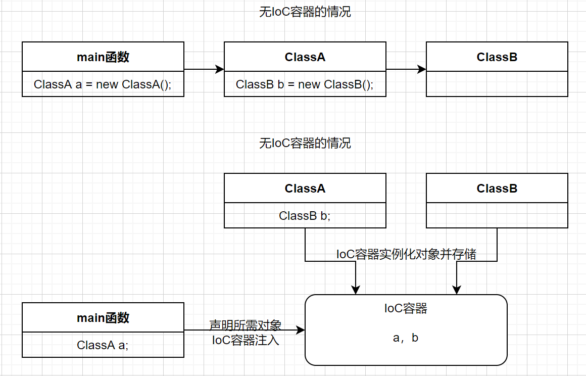
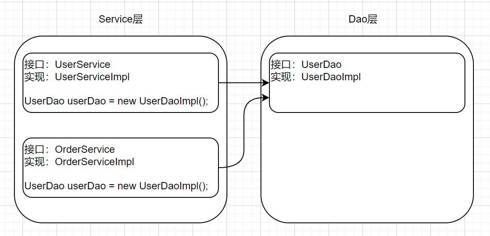

# Spring的核心思想

# 一、IoC

## 1.1 什么是IoC

IoC：inversion of control，控制反转，它是一种技术思想，并不是一个具体的技术实现。

描述的事情：Java开发领域对象的创建、管理问题。

  IoC不是一种技术，只是一种思想，一个重要的面向对象编程的法则，它能指导我们如何设计出松耦合、更优良的程序。传统应用程序都是由我们在类内部主动创建依赖对象，从而导致类与类之间高耦合，难于测试；有了IoC容器后，把创建和查找依赖对象的控制权交给了容器，由容器进行注入组合对象，所以对象与对象之间是松散耦合，这样也方便测试，利于功能复用，更重要的是使得程序的整个体系结构变得非常灵活。

在传统的开发模式中，类A依赖类B，往往会在类A中new一个类B的对象，这就造成了类与类之间的耦合，不便于管理。而IoC思想下的开发模式，我们不用自己去new对象，在需要依赖对象的地方进行一个声明即可，IoC容器会自动帮我们完成实例化并进行管理。我们不用在考虑对象的创建、管理等问题了。

为什么叫“控制反转”？

-   控制：指的是对象创建（实例化、管理）的权利
-   反转：控制权交给外部环境了（Spring框架、IoC容器）

## 1.2 IoC解决了什么问题

IoC解决了类之间强耦合的问题。

如图，在没有IoC的情况下，Service层对Dao等的依赖都是直接在类中创建依赖的对象，这就形成了强耦合，那如果我们突然要换UserDao的实现类，此时就需要将Service层所有对原UserDaoImpl的声明全部更换，一两个还好说，那如果对原实现的引用类有几十上百个呢？

IoC解决的就是这个问题，我们只需要在Service层声明对Dao层的组件即可，不需要去创建实例，容器会自动创建并为我们注入这个依赖。这就是下面要说的依赖注入。

## 1.3 IoC和DI的区别

DI：dependency injection，依赖注入。

可以说IoC是一种思想，而DI是具体的实现。也可以说IoC和DI描述的是同一件事，只不过在不同的角度，即IoC在对象的角度，将对象实例化、管理的权利交给容器；而DI则是在容器的角度将对象所需的依赖注入。

# 二、AOP

## 2.1 什么是AOP

AOP：Aspect Oriented Programming，面向切面编程/面向方面编程，是通过预编译方式和运行期动态代理的方式实现不修改源代码的情况下给程序动态统一添加功能的技术。

AOP技术利用一种称为“横切”的技术，剖解开封装对象的内部，将影响多个类的公共行为封装到一个可重用的模块中，并将其命名为`Aspect`切面。所谓的切面，简单来说就是与业务无关，却为业务模块所共同调用的逻辑，将其封装起来便于减少系统的重复代码，降低模块的耦合度，有利用未来的可操作性和可维护性。

利用AOP可以对业务逻辑各个部分进行隔离，从而使业务逻辑各部分之间的耦合度降低，提高程序的可重用性，同时提高开发效率。

AOP的使用场景主要包括日志记录、性能统计、安全控制、事务处理、异常处理等。

AOP是OOP的延续，

AOP和OOP是面向不同领域的两种思想，OOP面向对象编程主要是针对业务处理过程中的实体的属性和行为的抽象与封装，以获得更加清晰高效地逻辑单元。AOP面向切面编程是针对业务处理过程中的切面进行提取，它所面对的是处理过程中某个步骤或阶段，以获得逻辑过程中各部分之间低耦合性的隔离效果。

AOP可以说是OOP的补充和完善，OOP引入封装、继承、多态等概念建立了一种对象层次结构，用来模拟公共行为的一个集合。当需要为分散的对象引入公共行为的时候，OOP显得无能为力，也就是说，OOP允许定义从上到下的关系，但并不适合定义从左到右的关系。

## 2.2 AOP解决了什么问题

在不改变原有业务逻辑的情况下，增强横切逻辑代码，根本上解耦，避免横切逻辑代码重复。

## 2.3 为什么叫“面向切面编程”

切：指的是横切逻辑，原有业务代码逻辑我们不能动，只能操作横切逻辑代码，所以面向横切逻辑

面：横切逻辑代码往往要影响很多的方法，每一个方法都如同一个点，多个点构成一个面

